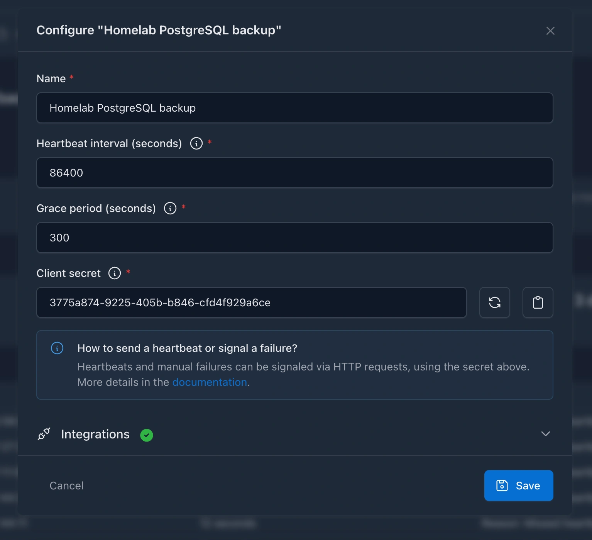
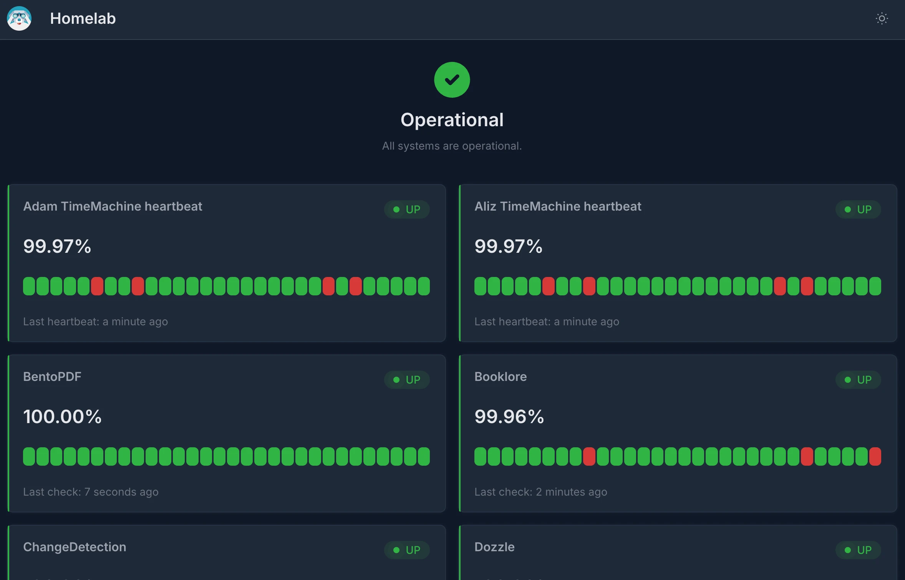
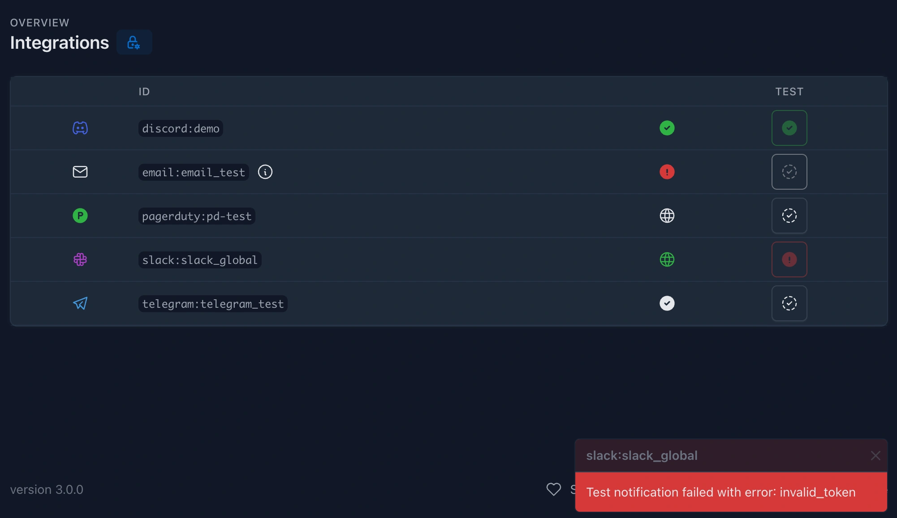
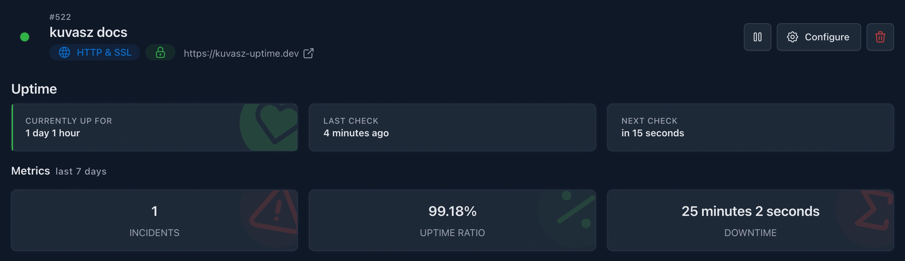
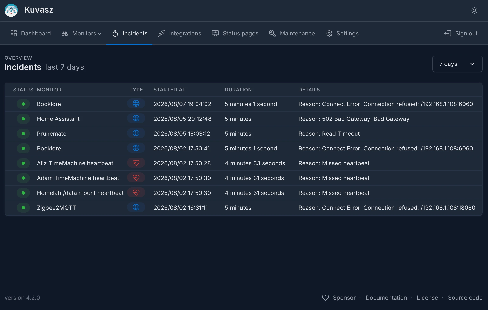
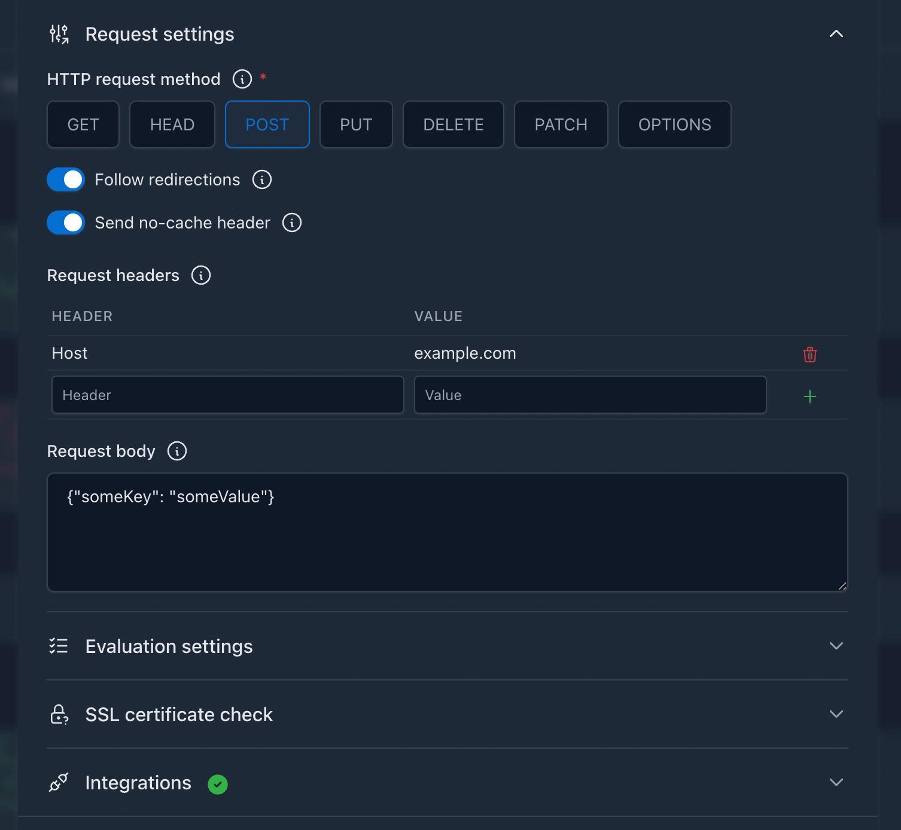
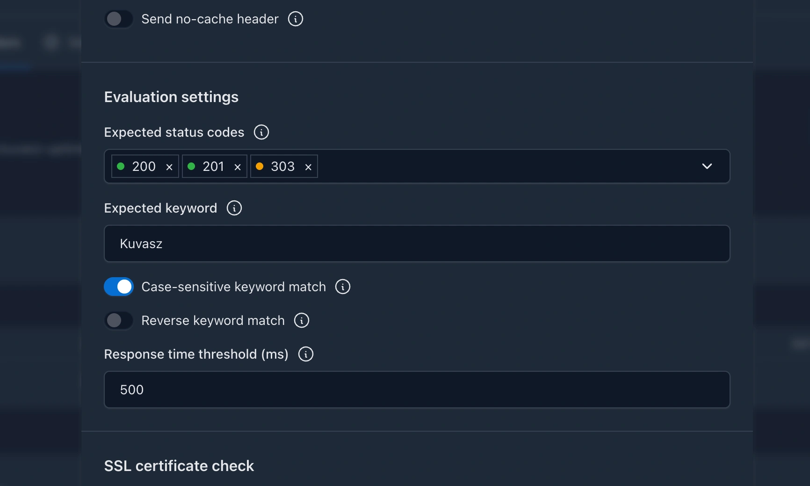

## 3.3.0 <small>2025-12-11</small> { id="3.3.0" data-toc-label="3.3.0" }

### Features

- An official **Helm chart** is available now to deploy _Kuvasz_ on Kubernetes clusters easily. See the [**Helm deployment guide**](setup/helm-deployment.md) for more details. Thanks for the contribution to [**@leofvo**](https://github.com/leofvo){ target="_blank" }!
- **Dark mode is the default** theme now on the UI, if you didn't change it manually before.

### Chore

- Bumped dependencies to their latest versions

## 3.2.4 <small>2025-10-30</small> { id="3.2.4" data-toc-label="3.2.4" }

### Fixes

- Fixed a bug that was introduced in 3.2.3 and caused push monitors to stuck in DOWN mode.

## 3.2.3 <small>2025-10-30</small> { id="3.2.3" data-toc-label="3.2.3" }

### Fixes

- Fixed a bug that caused to create conflicting uptime event records in the database in case of a rare race condition between consecutive uptime checks of the same monitor. The fix also takes care of repairing the corrupted state of these monitors upon the next check.

## 3.2.2 <small>2025-10-23</small> { id="3.2.2" data-toc-label="3.2.2" }

### Fixes

- Fixed a memory leak that caused instable memory usage, and changed the base image to `eclipse-temurin:21-jre-ubi9-minimal`. Due to the base image change, if you're **using your own certificates**, attached to the container, you'll need to **update your volume mapping accordingly**. (See _"Providing a custom root certificate for SSL checks"_ in the documentation for more details)

## 3.2.1 <small>2025-10-23</small> { id="3.2.1" data-toc-label="3.2.1" }

### Fixes

- Reverted the large-header handling change from 3.2.0 that causes stability issues due to the higher usage of memory.

## 3.2.0 <small>2025-10-23</small> { id="3.2.0" data-toc-label="3.2.0" }

### New features

- [**Push monitors**](features/push-monitoring.md): Also known as _cron_ or _heartbeat_ monitors. You can create monitors to watch your services or scheduled jobs that are not accessible via HTTP, but you still want to keep an eye on them.

### Improvements

- The HTTP checks' request and expected **headers' names are less restrictive**, and also RFC 9110 compliant. Thanks to [**@LosDrakakos**](https://github.com/LosDrakakos){ target="_blank" } for the contribution!
- **Large headers** (> 8192 bytes) are handled more gracefully, and they don't end up in false positive uptime errors anymore.
- Documentation: added [**unofficial deployment guides**](setup/installation.md#unofficial-guides)
- Monitors are completely [**deletable via `YAML`**](management/managing-monitors/index.md#__tabbed_1_2) (previously it wasn't possible to distinguish between omitted and empty monitors in the YAML config).

### Fixes

- SSL checks are using now a logic that is not bound to HTTP requests, so it's possible to check the certificate of endpoints, that are not accessible via HTTP.

## 3.1.0 <small>2025-09-23</small> { id="3.1.0" data-toc-label="3.1.0" }

### New features

- [**Status pages**](features/status-pages.md): You can create public and also private, brandable status pages for your monitors, to keep your customers or your own team informed about the status of your services. See the [**Managing status pages**](management/status-pages.md) section for more details regarding the configuration options.

### Improvements

- [**Integration names**](management/integrations.md#name) can be totally **arbitrary** now, the previous restriction of containing only alphanumeric characters, hyphens and underscores has been lifted.
- **Added recipes & examples**:
    - How to [**use a reverse proxy**](management/examples.md#exposing-status-pages-on-subdomains-behind-a-reverse-proxy) for the status pages
    - How to [**backup and restore your monitors and status pages**](management/examples.md#backup-restore-with-yaml)
    - How to [**include your custom/private certificates**](management/examples.md#providing-a-custom-root-certificate-for-ssl-checks) in the Docker image, to be able to monitor endpoints with such certs
- The API docs are having a [**dedicated site**](https://api-docs.kuvasz-uptime.dev){ target="_blank" } now to make them easier to find and browse. 

## 3.0.2 <small>2025-08-31</small> { id="3.0.2" data-toc-label="3.0.2" }

### Fixes

- Fixed a bug where the historical HTTP uptime stats could contain incorrect values in case a paused monitor's ongoing incident was updated before the requested time range of stats
- Fixed a bug where the monitor-specific incidents were not returned in case of a paused monitor

## 3.0.1 <small>2025-08-31</small> { id="3.0.1" data-toc-label="3.0.1" }

### Breaking changes

This is a major release that paths the way for **new monitor types** in the future, by handling the already existing HTTP monitors in a more explicit way. There are a few breaking changes in there, so please **refer to the** [**Upgrade notes**](upgrade-notes.md#upgrade-from-v2xx-to-v3xx) for more details. 
Don't be afraid, the upgrade process is straightforward and well-documented, and if you follow the steps, everything should go smoothly.

### New features

- **Integrations** have their own section on the UI now, and they are also exposed under a new API endpoint (`GET /api/v2/integrations`). Furthermore, [**you can test them**](management/integrations.md#testing-integrations) directly from the UI, or via the API to make sure that they are working as expected, before you would enable them or assign them to monitors.

- **Update notifications**: you can now [**get notified about new releases**](setup/installation.md#keeping-kuvasz-up-to-date) of _Kuvasz_ on the UI and through the API on `GET /api/v2/settings`. This way, it's easier to stay up-to-date with the latest features and improvements.
- **Monitor-level metrics**: the uptime ratio, incident count and total downtime metrics are now available on a per-monitor basis (both on the UI & via the v2 [API](https://api-docs.kuvasz-uptime.dev)), not just as cumulated metrics across all monitors.

- **Incidents**: there is a brand new section on the UI, and a dedicated endpoint under `GET /api/v2/incidents` to see/fetch **all your incidents in one single place**, where you can also filter them by a monitor, or by a time range.

### Fixes

- Clear the expected status code select's search value after selecting an option (by [WasixXD](https://github.com/WasixXD){target="_blank" })
- Fix the background color of the active option inside the expected status codes select

## 2.5.1 <small>2025-08-23</small> { id="2.5.1" data-toc-label="2.5.1" }

### Fixes

- Fixed a bug where the historical uptime stats could contain misleading values in case of prolonging incidents that overlap with the requested time range of stats.

## 2.5.0 <small>2025-08-22</small> { id="2.5.0" data-toc-label="2.5.0" }

### New features

- **Custom request headers**: you can now specify custom headers to be sent with the HTTP requests, allowing for more flexible and tailored monitoring setups. See the [**HTTP monitors > Request headers**](management/http-monitors.md#request-headers) section for more details.
- **Custom request body**: you can send your own JSON body to the monitored HTTP endpoint, which can be useful for testing APIs that require a specific payload. See the [**HTTP monitors > Request body**](management/http-monitors.md#request-body) section for more details.
- **Expected headers**: this is a brand new evaluation option that allows you to specify expected headers in the HTTP response. If the response does not contain the expected headers, the monitor will be marked as `DOWN`. You can find more details in the [**HTTP monitors > Expected headers**](management/http-monitors.md#expected-headers) section.
- **New HTTP request methods**: `POST`, `PUT`, `PATCH`, `DELETE` and `OPTIONS` are now supported in addition to the existing `GET` and `HEAD`. This allows you to monitor endpoints that require different HTTP methods, such as APIs that expect a `POST` request with a specific payload. See the [**HTTP monitors > Request method**](management/http-monitors.md#request-method) section for more details.
- **Revamped UI for creating and editing HTTP monitors**: the UI of the existing modal has been slightly redesigned to make it easier and more convenient to configure HTTP monitors with the new features. The fresh look is hopefully more intuitive and user-friendlier by having a **better structure**.

## 2.4.0 <small>2025-08-15</small> { id="2.4.0" data-toc-label="2.4.0" }

### New features

- **New HTTP response evaluation options**: you can now configure your HTTP monitors to:
    - accept only [**specific HTTP status codes**](management/http-monitors.md#expected-status-codes) as valid responses
    - check for a [**keyword in the response body**](management/http-monitors.md#expected-keyword), and you can make the check optionally [**case-sensitive**](management/http-monitors.md#expected-keyword-case-sensitivity), or also [**reversed**](management/http-monitors.md#expected-keyword-negation) to check for the absence of the keyword
    - **[check the response time](management/http-monitors.md#response-time-threshold)** against a **threshold** (in milliseconds) to ensure that the response is not only valid but also fast enough

- **More details** are persisted **about the errors** that occur during the HTTP uptime checks
- Added **French** translation, thanks to [**@waazaa-fr**](https://github.com/waazaa-fr){ target="_blank" }!
- Added **Polish** translation, thanks to [**@nkkfs**](https://github.com/nkkfs){ target="_blank" }!
- Made the **URL on details page clickable**, so you can easily open the target URL in a new tab

### Improvements

- **Re-worked the logic of the HTTP uptime check configuration & evaluation** to make it easier to introduce new configuration & evaluation options in the future
- [**@by-su**](https://github.com/by-su){ target="_blank" } **improved the validation messages** around the admin authentication configuration, and also extended the docs to clarify the usage of it, thanks for that!
- **Other validation messages** have been improved as well, to make them more user-friendly if something goes wrong during the bootstrapping of _Kuvasz_ or during an API request.
- **Client-related HTTP response errors are not retried** anymore, only the server-related ones. This means practically that 4xx responses will be evaluated as-is without retrying them, while 5xx responses will be retried up to 3 times with an exponential backoff strategy.

### Fixes

- Translated the "...[REDACTED]" string to make it internationalization friendly
- **Fixed the latency measurement logic** to not include the time spent on retrying failing HTTP requests
- **Fixed the following CVEs** by upgrading 3rd party dependencies:
    - [CVE-2025-49146](https://nvd.nist.gov/vuln/detail/CVE-2025-49146){ target="_blank" }
    - [CVE-2025-53864](https://nvd.nist.gov/vuln/detail/CVE-2025-53864){ target="_blank" }

## 2.3.1 <small>2025-07-25</small> { id="2.3.1" data-toc-label="2.3.1" }

### Fixes

- Make sure that no deadlocks can occur during the uptime checks by introducing an expiry for every single lock as a fail-safe fallback mechanism
- UI: Align the cards on the settings page better, by not having gaps between them

### Chore

- Dependencies: bumped i18n4k to 0.11.0

## 2.3.0 <small>2025-07-19</small> { id="2.3.0" data-toc-label="2.3.0" }

### Features

- **Discord integration**: Added support for sending notifications to Discord channels via webhooks. Configure Discord integrations in your YAML file and receive real-time alerts about monitor status changes directly in your Discord server.

## 2.2.0 <small>2025-07-17</small> { id="2.2.0" data-toc-label="2.2.0" }

### Features

- **Metrics exporter settings** are exposed both on the API (under `GET /api/v1/settings`) and on the UI, so you can easily get an overview of the effective configuration.
- A **live demo** is available at [**demo.kuvasz-uptime.dev**](https://demo.kuvasz-uptime.dev){ target="blank" } where you can try out the latest features of _Kuvasz_ without setting up your own instance. Further details, credentials [**here**](demo.md).

### Fixes

- Fixed the glitch on the UI regarding read-only mode in case the underlying logic was initialized before YAML monitors were loaded. This caused the UI to not show the read-only mode correctly, even though the backend was working as expected.

## 2.1.0 <small>2025-07-11</small> { id="2.1.0" data-toc-label="2.1.0" }

### Features

- **Metrics exporters**: Added support for exporting metrics to _OpenTelemetry_ and _Prometheus_. See the [**Metrics exporters**](management/metrics-exporters.md) section for more details. With this feature, you easily integrate _Kuvasz_ with your existing observability stack. Currently exposed metrics are:
    - Uptime status
    - Latest latency
    - SSL status
    - SSL expiry date
- **Bearer token authentication**: Added support for [**Bearer token authentication on the API**](features/api.md#authentication), along with the existing API key authentication. This allows you to use the same authentication mechanism as other modern APIs, making it easier to integrate with your existing systems.

## 2.0.0 <small>2025-07-02</small> { id="2.0.0" data-toc-label="2.0.0" }

### Breaking changes

- **Native image build logic has been removed**: Native images will not be supported in the future due to their higher level of unpredictability, and the achieved performance gain/resource saving in exchange is not so significant.
- **PostgreSQL 12+** is the minimum supported DB version.
- **The HTTP communication log has been removed**, because it was an unnecessary overhead in the network pipeline, and a built-in solution is also available now.
- **Authentication** has been fully reworked, read the [**Authentication**](setup/configuration.md#authentication) section for more details.
- The **latency data** (avg, p95, p99) of the monitors are not returned under `MonitorDetailsDto`, because a new endpoint is introduced for metrics like this under `/api/v1/monitors/{monitorId}/stats`
- (might be breaking, but not necessarily): SSL validation now takes **intermediate certs** into account
- The `DELETE /monitors/{monitorId}/pagerduty-integration-key` and `PUT /monitors/{monitorId}/pagerduty-integration-key` endpoints are gone, because the PATCH endpoint is now flexible enough to support both use-cases.

### Features

- **New Monitor attributes** (every default value also applies for the existing monitors):
    * `requestMethod`: `GET` or `HEAD`. The latter is generally faster, but be aware that certain targets might not support it (default `GET`)
    * `latencyHistoryEnabled`: `true` or `false`. If set to `false` latency will be not logged or returned in the monitors' metrics -> Better for a snappier experience on a slow machine (default `true`)
    * `forceNoCache`: `true` or `false`. If set to `true`, a `Cache-Control: no-cache` header will be sent with the request (default `true`)
    * `followRedirects`: `true` or `false`. If set to `true`, Kuvasz will follow redirects during uptime checks, and the last, non-redirected URL will be evaluated (default `true`)
    * `sslExpiryThreshold`: The number of days before the SSL certificate expires when a notification should be sent.
- **Option to disable authentication** (useful in a home-lab, for example) via `ENABLE_AUTH`. `true` or `false`, default `true`
- **Optimization of the check scheduling logic**: the first uptime check will be scheduled randomly between 1 second and the configured interval of the monitor to prevent hitting the HTTP client with a lot of requests right after the startup.
- **Optimization of the uptime checker**:
    * Made the error handling more robust by handling exceptions that come from invalid response format (e.g. invalid status code)
    * Increased the client's read timeout to 30s
    * Added support for non-absolute redirect URLs (a redirect location of `/path/something-else` on `https://example.com` will be resolved as `https://example.com/path/something-else`
    * Detect and avoid redirect loops
- **Improvement of the `DOWN` event's error formatting** both for showing and saving it. Non-visible/printable characters, and long response errors are now sanitised and might be redacted. If the uptime check fails with a standard HTTP status code and a standard error response, then the HTTP status and its name will be the error's "label" (e.g. `403 Forbidden`)
- Initial (i.e. **if there is no previous state for a given monitor**) UP & VALID states of uptime & SSL checks are not sent to RTC & SMPT event handlers to prevent sending irrelevant notifications upon the first startup
- The **latency metrics** calculation logic **has been optimized** to handle large datasets efficiently
- ✨A brand-new **Web UI** has been introduced, which is more modern, responsive, and user-friendly
- Monitors are configurable via a **YAML file** besides the UI and the API ("_infrastructure as code_" way)
- Exposed `nextUptimeCheck` and `nextSSLCheck` on the API
- Made `sslValidUntil` persisted on the SSL events, and exposed it on the API
- `sslExpiryThreshold` is configurable now on a per monitor basis
- Uptime & latency data retention are separetely configurable now
- Made the whole project translatable (the only language set up is English, as of now, but future translations are already super-easy)
- Monitor filtering on the API was greatly improved with new filters: `enabled: Boolean?`, `sslCheckEnabeld: Boolean?`, `uptimeStatus: UptimeStatus[]?` and `sslStatus: SSLStatus[]?`
- App and integration settings are exposed now both on the UI and on the API (under `GET /api/v1/settings`)
- Added more latency metrics to `GET /api/v1/monitors/{monitorId}/stats`: min, max and p90
- The integration setup has been completely reworked, making it smarter and more flexible. From now on, you can set up **multiple integrations per type** (Slack, E-mail, etc.) in your YAML config. Then you can make them global (that is in effect for all your monitors without further configuration), or **you can assign them on a per monitor basis**.

### Chore
- Simplified and streamlined the things around jOOQ
- Simplified the logging configuration by moving it to Micronaut's own config file
- Changed the base image to `liberica-runtime-container:jre-17` and reduced the compressed image size by ~23%
- Build `arm64` images too
- Bumped the 3rd party dependencies to their latest versions
- Use Java 21
- Switched to a multi-module project layout (should have done it at the beginning 🤦 )
- Switched to kover from JaCoCo

The **full changelog** is available on [**GitHub**](https://github.com/kuvasz-uptime/kuvasz/releases/tag/2.0.0)
