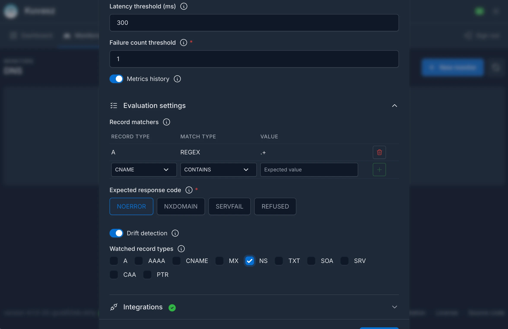

DNS monitoring allows you to check whether a **name resolves**, whether it resolves **to the right thing**, and whether the answer **changed behind your back** - by periodically querying the name with a real DNS resolver.

## How does it work?

_Kuvasz_ monitors your domain names by **periodically sending DNS queries** for them. For each check it measures and evaluates:

- **Resolvability** (whether the resolver answered at all, within the timeout)
- **Resolution latency** (the total time the check's assertion queries took)
- **The answer itself** (whether the returned records satisfy your assertions)
- **The response code** (whether the resolver returned what you expect, e.g. `NOERROR` or `NXDOMAIN`)

If the resolver cannot be reached within the check's [**timeout budget**](../management/dns-monitors.md#timeout), if the [**response code**](../management/dns-monitors.md#expected-response-code) differs from the expected one, if any of the configured [**record matchers**](../management/dns-monitors.md#record-matchers) fails, or - when configured - if the resolution takes longer than the optional [**latency threshold**](../management/dns-monitors.md#latency-threshold), the monitor is marked as DOWN and you will be **notified** through your configured notification channels.

If you don't configure any record matcher, the check falls back to a plain `A` lookup, and the up/down status is decided by the [**response code**](../management/dns-monitors.md#expected-response-code) alone: the monitor is UP as long as the resolver answers with the expected one, `NOERROR` by default.

### Asserting on the records

Instead of a single expected value, a DNS monitor holds a **list of record matchers**. Each matcher targets one **record type** (`A`, `AAAA`, `CNAME`, `MX`, `NS`, `TXT`, `SOA`, `SRV`, `CAA`, `PTR`) with a **match type** (`EXACT`, `CONTAINS` or `REGEX`) and a **value**.

- **All matchers must pass** (they are ANDed), and a single matcher passes when **at least one record** of its type satisfies it.
- Only the record types your matchers actually cover are queried, so a monitor never pays for lookups it doesn't need - unless you widen the [drift watch list](../management/dns-monitors.md#drift-record-types) explicitly.
- The returned records are **normalized** to their canonical `dig` presentation, and `EXACT` / `CONTAINS` values go through the same normalization before they are compared, so you can paste `dig` output verbatim. `REGEX` patterns are used as-is and matched against the normalized record.

This model covers the everyday cases without any extra configuration: `CONTAINS` is enough for an SPF or DKIM fragment inside a long `TXT` record, two `EXACT` matchers express *"both of these IPs must be present"*, and [`REGEX`](../management/dns-monitors.md#regex-patterns) - using the **Java / Kotlin regular expression syntax** - handles everything else.

### Drift detection

Beyond up/down, _Kuvasz_ can tell you when the **resolved records change** - a hijacked delegation, an accidental `NS` switch during a migration, or an `MX` record someone edited without telling you.

When [**drift detection**](../management/dns-monitors.md#drift-detection) is enabled, _Kuvasz_ keeps the last resolved answer set as a baseline, and whenever a check returns a different one, it sends a **dedicated `DNS_RECORDS_CHANGED` notification** and re-seeds the baseline. This is evaluated **independently of the up/down status**: a perfectly healthy monitor can - and should - report drift, since that is exactly the situation worth knowing about.

It is **opt-in per monitor**, because plenty of answer sets legitimately rotate (CDNs, short-TTL load balancers), and alerting on those would only produce noise.

### What can be configured?

- interval for uptime checks
- the domain name to query
- an optional custom nameserver (host + port) instead of the system resolver
- the transport to use (`UDP` with automatic TCP fallback, or forced `TCP`)
- record matchers (record type + match type + value, all ANDed)
- the expected DNS response code (`NOERROR`, `NXDOMAIN`, `SERVFAIL`, `REFUSED`)
- check timeout budget, shared by every query of a check (1-30000 milliseconds)
- optional resolution-latency threshold that triggers a DOWN event
- consecutive failure count threshold
- drift detection, optionally scoped to specific record types

## Configuration <!-- md:config ../management/dns-monitors.md -->

Please refer to the [**Managing DNS monitors**](../management/dns-monitors.md) section of the documentation for more information on how to configure DNS monitoring.
