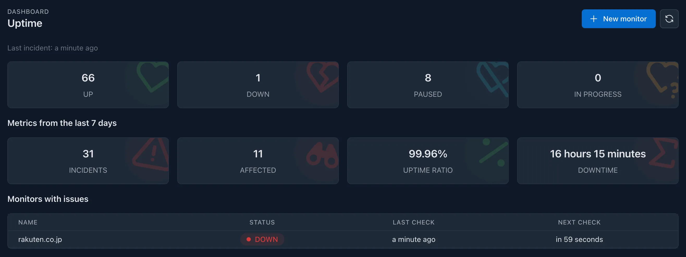

HTTP uptime monitoring is a crucial feature that allows you to keep track of the **availability and performance** of your websites and services. It helps you ensure that your applications are running smoothly and **alerts you** when they are down or experiencing issues, which is essential for maintaining a reliable user experience.

## How does it work?

_Kuvasz_ monitors your websites and services by **periodically sending requests** to them. It checks the response status codes, response times, and other metrics to determine if the service is up and running. If a service is down or not responding as expected, Kuvasz will **notify you** through your configured notification channels.

### What can be configured?

- interval for uptime checks
- HTTP method (`GET` or `HEAD` as of now)
- URL to monitor
- whether to follow redirects
- request headers
- request body
- response time threshold in milliseconds (maximum 30 seconds)
- accepted status codes (default is 2xx)
- keyword matching in the response body, with the option to ignore case and also to reverse the match (i.e. to alert if the desired keyword is present in the response body)
- expected headers in the response

## Notable features

- **HTTP(S) monitoring**: Monitor the availability and performance of your websites and services by sending HTTP(S) requests.
- **Response time tracking**: Track the latency of your services by measuring the time it takes to receive a response from them.
- **Notifications on a per-monitor basis**: Configure different notification channels for each monitor, allowing you to tailor alerts to your specific needs.

## Configuration <!-- md:config ../management/http-monitors.md -->

Please refer to the [**Managing HTTP monitors**](../management/http-monitors.md) section of the documentation for more information on how to configure uptime monitoring.
