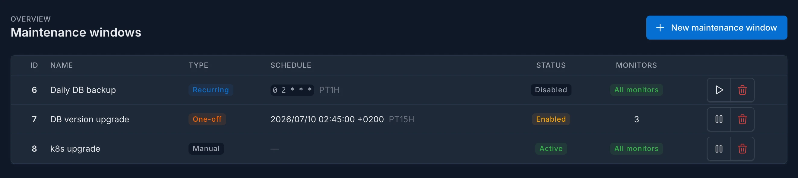
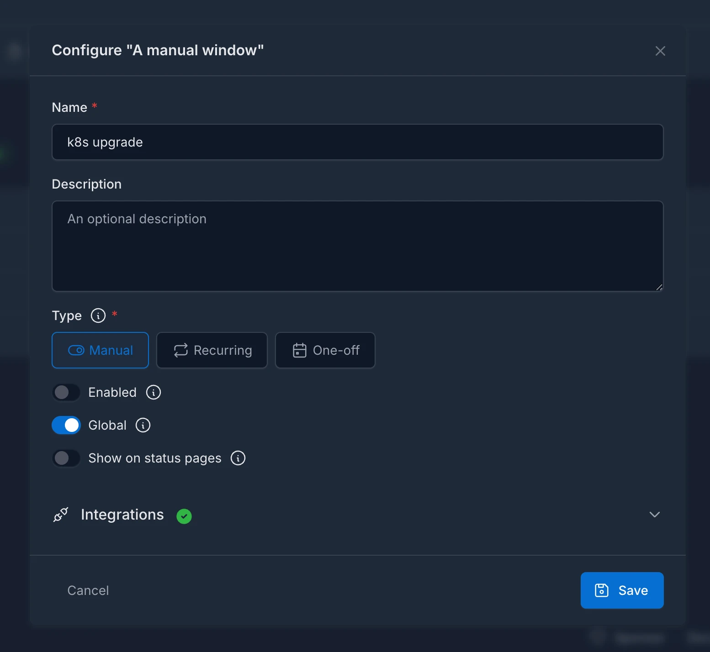
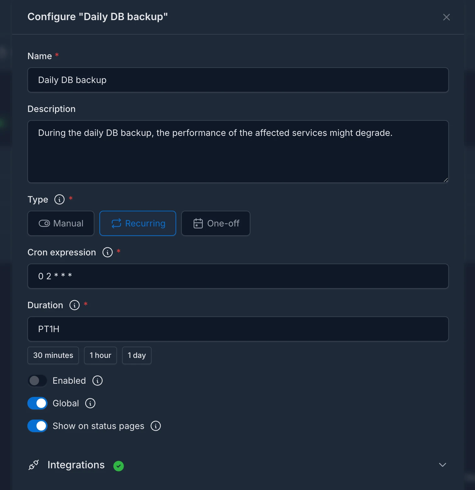
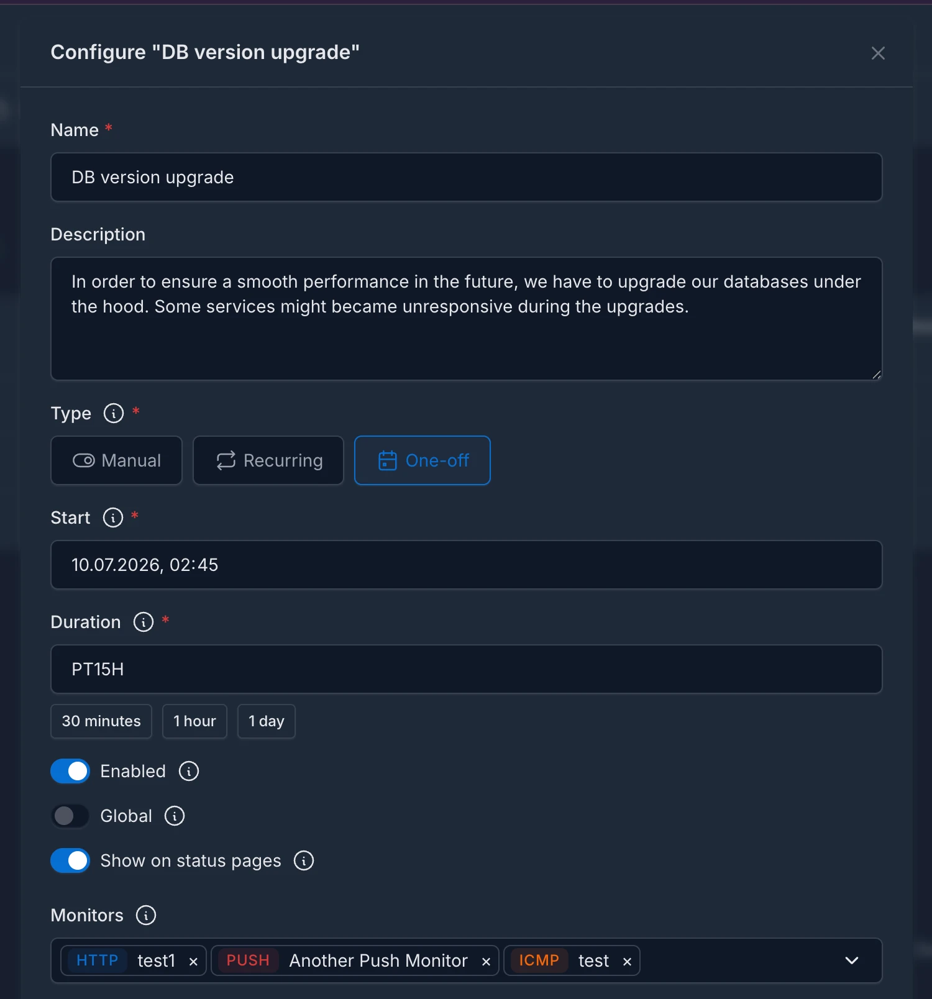
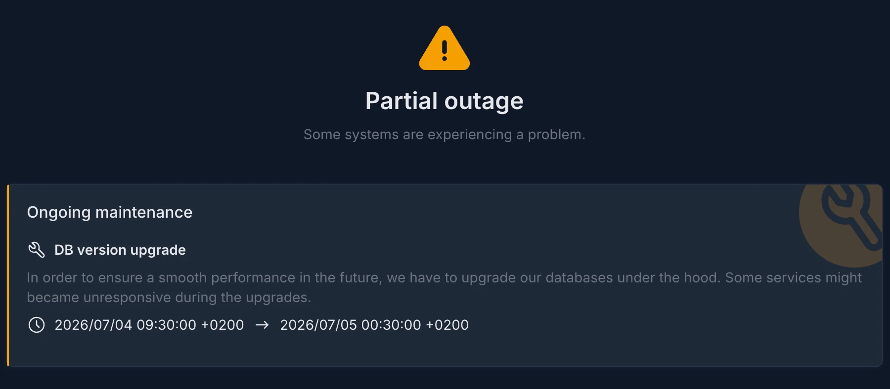

Maintenance windows let you tell _Kuvasz_ about **planned downtime** in advance, so it **pauses the affected checks and suppresses false alerts** while you're doing scheduled work — a database migration, a deployment, a nightly backup job, or anything else that would otherwise trip your monitors.

Instead of muting integrations by hand (and forgetting to unmute them), you describe **when** the maintenance happens, **which monitors** it affects, and **who** should be notified, and _Kuvasz_ takes care of the rest.

## What can be configured? <!-- md:config ../management/maintenance-windows.md -->

A maintenance window has a **schedule**, a **scope**, and an optional set of **integrations** to notify. There are three kinds of schedules:

- **Manual**: no schedule at all — the window is active for as long as you keep it enabled, and you toggle it on and off yourself. Useful for ad-hoc, open-ended maintenance when you don't know exactly how long it will take.

- **Recurring**: defined by a **cron expression** and a **duration**, e.g. "every night at 02:00 for 1 hour". Perfect for regularly scheduled tasks like nightly backups.

- **One-off**: defined by a **start timestamp** and a **duration**, e.g. "next Saturday at 22:00 for 2 hours". Ideal for a single planned event.

Regardless of the schedule, you can configure:

- **Scope**: a window can be **global** (it applies to every monitor), or scoped to a **specific set of monitors**.
- **Notified integrations**: the integrations that should receive the window's **start and end** notifications.
- **Status page visibility**: whether the window may be [displayed on your status pages](status-pages.md), so your users can see that a maintenance is active or coming up.

!!!tip

    You can **choose how you would like to manage** your maintenance windows: via the _Web UI_, the _REST API_, or with a _YAML configuration_ file. For more information, please refer to the [**Maintenance windows management**](../management/maintenance-windows.md) section of the documentation.

## What happens during a maintenance window?

While a maintenance window is active, for every monitor in its scope:

- **Uptime checks are paused.** HTTP and ICMP checks are skipped entirely, SSL checks are postponed, and the scheduled heartbeat expiry check for push monitors is skipped. This means **no false incidents and no false alerts** are generated by the planned downtime.
- **Start and end notifications are sent** to the integrations explicitly assigned to the window. On _PagerDuty_, the start event triggers a `warning` alert that is automatically resolved by the end event.

!!!warning "Maintenance notifications only go to explicitly assigned integrations"

    Unlike regular monitor events, maintenance start/end notifications are sent **only to the integrations assigned to the window** — globally-enabled integrations are intentionally ignored unless you assign them explicitly. See the [**Notifications**](notifications.md#maintenance-events) documentation for the details.

!!!info "Incoming push signals are never blocked"

    Maintenance only pauses the checks _Kuvasz_ runs on its own. If a **push (heartbeat) monitor** actively reports its status (a heartbeat ping, or an explicit failure signal) during a maintenance window, that signal is still recorded and processed as usual, because muting an external client that is actively talking to you would be kind of weird.
