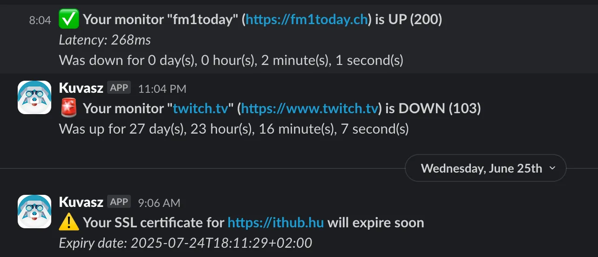
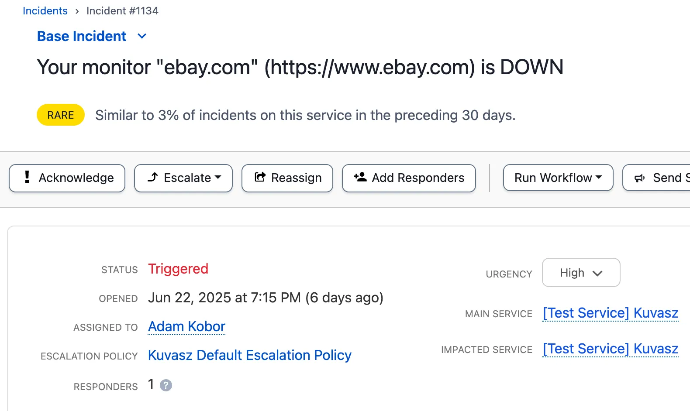
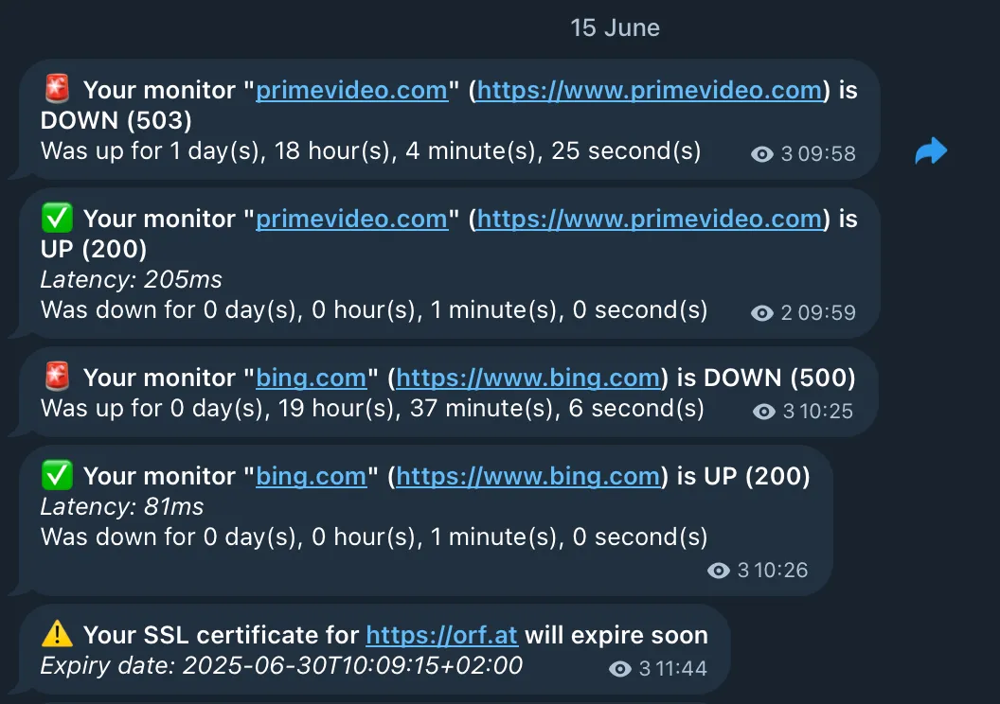

_Kuvasz_ supports a variety of integrations to help you **stay informed
** about the status of your monitors. If you're curious about the configuration options, just click on the <!-- md:config --> icon, next to the integration name, and it will take you to the relevant section of the configuration documentation.

!!! info

    Integrations can be:
    
    - **global**, meaning that they can be used for all monitors by default, or
    - assigned to **specific monitors**.

    You can also configure **multiple integrations of the same type**, for example, multiple Slack channels, or multiple email addresses to notify.

## Watched events

Every integration **watches a set of events
** by default, which are fired by the monitors. These events are currently the following:

### Uptime events

| Event                               | Description                                                            |
|-------------------------------------|------------------------------------------------------------------------|
| `HTTP_UP` `PUSH_UP` `ICMP_UP`       | Fired, when a monitor is **healthy** now (and it was unhealthy before) |
| `HTTP_DOWN` `PUSH_DOWN` `ICMP_DOWN` | Fired, when a monitors is **unhealthy**                                |

### SSL events

| Event             | Description                                                                                            |
|-------------------|--------------------------------------------------------------------------------------------------------|
| `SSL_VALID`       | Fired, when an SSL certificate is **valid** now (and it was `SSL_INVALID` or `SSL_WILL_EXPIRE` before) |
| `SSL_INVALID`     | Fired, when an SSL certificate is **invalid or expired** now                                           |
| `SSL_WILL_EXPIRE` | Fired, when an SSL certificate **will expire in the next X days** (`X` is configurable per monitor)    |

### Maintenance events

| Event               | Description                                 |
|---------------------|---------------------------------------------|
| `MAINTENANCE_START` | Fired, when a **maintenance window starts** |
| `MAINTENANCE_END`   | Fired, when a **maintenance window ends**   |

Maintenance notifications behave differently from monitor events:

- They are sent **only to the integrations explicitly assigned to the maintenance window**. Unlike monitor events, **globally-enabled integrations are intentionally ignored** here, so a global integration only receives maintenance notifications when it is explicitly assigned to the window.
- All integration types are supported (Slack, Discord, Email, PagerDuty, Telegram and custom webhooks). On PagerDuty a start event triggers a `warning` alert and the end event resolves it.
- For **custom webhooks**, maintenance events reuse the same payload contract as monitor events, but the monitor-specific fields are blank, because a maintenance window is not tied to a single monitor: `monitorId` is `0` and `monitorUrn`, `monitorName` and `monitorDetailsUrl` are empty strings. The `type`, `timestamp` and `eventDetails` fields are populated as usual, and any existing `payloadTemplate` keeps working (the blank monitor variables simply render as empty).

!!! tip "Excluding certain events"

    You can [exclude certain events](../management/integrations.md#excluded-events) from triggering notifications on a per-integration basis. This allows you to, for example, only receive notifications about downtime, but not about SSL certificate issues. This works for maintenance events too.

## Slack <!-- md:config ../management/integrations.md#slack -->

You can set up
_Slack_ as a notification channel for your monitors. This allows you to receive notifications about the status of your monitors directly in your Slack channels.

## Discord <!-- md:config ../management/integrations.md#discord -->

The _Discord_ integration allows you to send notifications **to Discord channels
**. This allows you to receive notifications about the status of your monitors directly in your Discord channels.

## Email <!-- md:config ../management/integrations.md#email -->

The email integration lets you to configure an _SMTP_ connection, with which
_Kuvasz_ can send you simple email notifications about the status of your monitors.

## PagerDuty <!-- md:config ../management/integrations.md#pagerduty -->

The _PagerDuty_ integration allows you to trigger **incidents in PagerDuty
** when a monitor goes down or an SSL certificate is invalid or will expire soon. This way, you can ensure that your team is notified immediately about critical issues. Incidents will be
**automatically resolved** when the monitor is back up or the SSL certificate is valid again.

## Telegram <!-- md:config ../management/integrations.md#telegram -->

The _Telegram_ integration allows you to send notifications **to a specific Telegram chat
** via the Bot API. You can use it to receive notifications about the status of your monitors **directly in your
Telegram app**.

## Webhooks <!-- md:config ../management/integrations.md#webhooks -->

The _Webhook_ integration allows you to send notifications to **any HTTP endpoint
**. This is a very flexible integration, as it allows you to integrate with **any service that supports incoming
webhooks**, or even with your own custom backend.

Since you can configure which events the webhook should watch, and also the payload via custom templates, you can use this integration to
**build your own custom notifications** or to integrate with services that are not supported out of the box.

!!! tip "Do you miss an integration?"

    If you **miss an integration**, please [open an issue](https://github.com/kuvasz-uptime/kuvasz/issues/new?template=feature_request.md){target="_blank"}, or consider contributing it yourself! We are always open to new integrations and **would love to see your contribution**.
