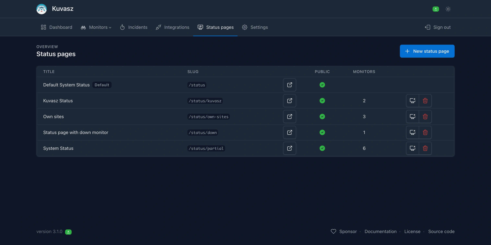

Status pages are one of the key features of a proper monitoring system. They help you **communicate the status of your services** to your customers or internal teams, and can also be used to display historical uptime and incident information.

## What can be configured?

There are two types of status pages available: the **default, built-in one, that contains every enabled monitors automatically**. The other type is a **custom status page**, which allows you to select the monitors you would like to display.
Both types supports the following features:

- **Public or private access**: You can choose to make your status page public, or make it available only to authenticated users.
- **Custom logo and favicon**: You can reference your own logo and favicon to match your branding.
- **Custom title and slug**: You can set a custom title and URL for your status page.
- **Historical statistics** from the last 30 days:
    - uptime percentage
    - average response time (a.k.a. "latency") if recorded
    - number of incidents per day
- **Server-side caching**: To improve performance, status pages are cached on the server-side. You can configure the cache duration to balance between performance and data freshness.

!!!tip 

    You can **choose how would like to manage** your status pages: via the _Web UI_, the _REST API_, or with a _YAML configuration_ file. For more information, please refer to the [**Status pages management**](../management/status-pages.md) section of the documentation.

