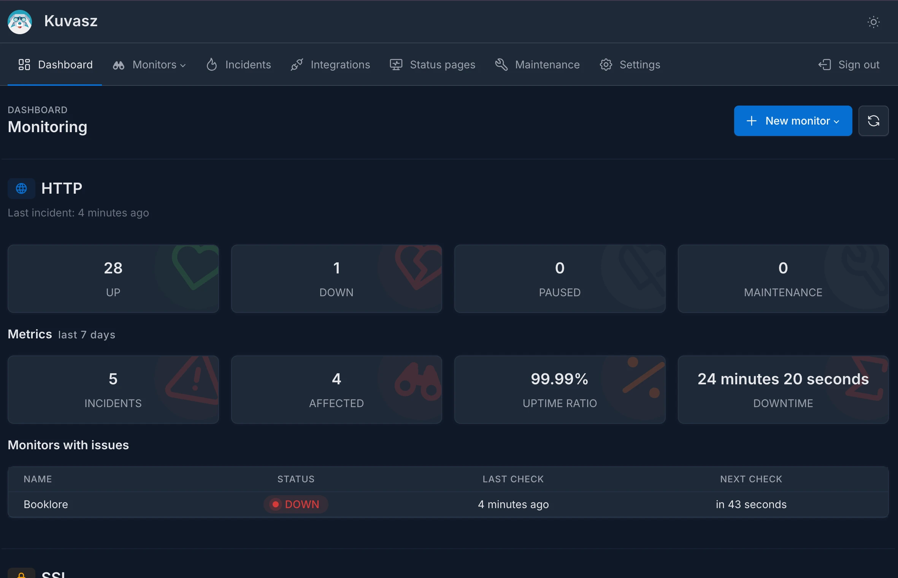
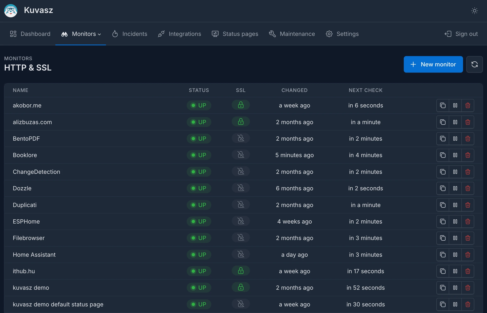
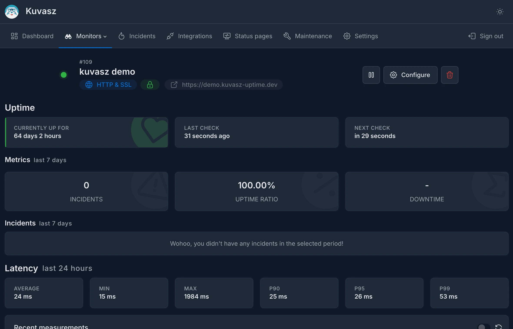
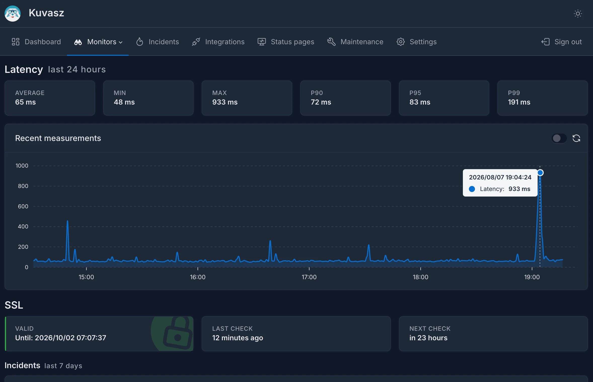
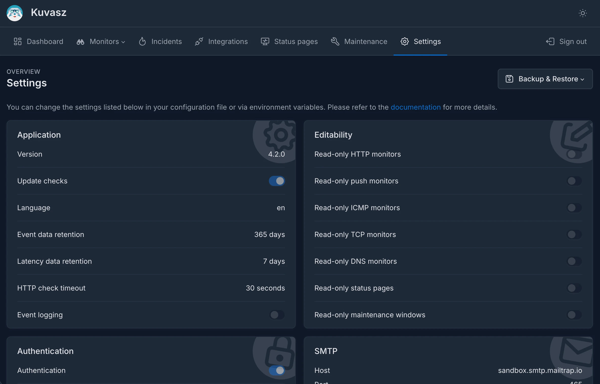
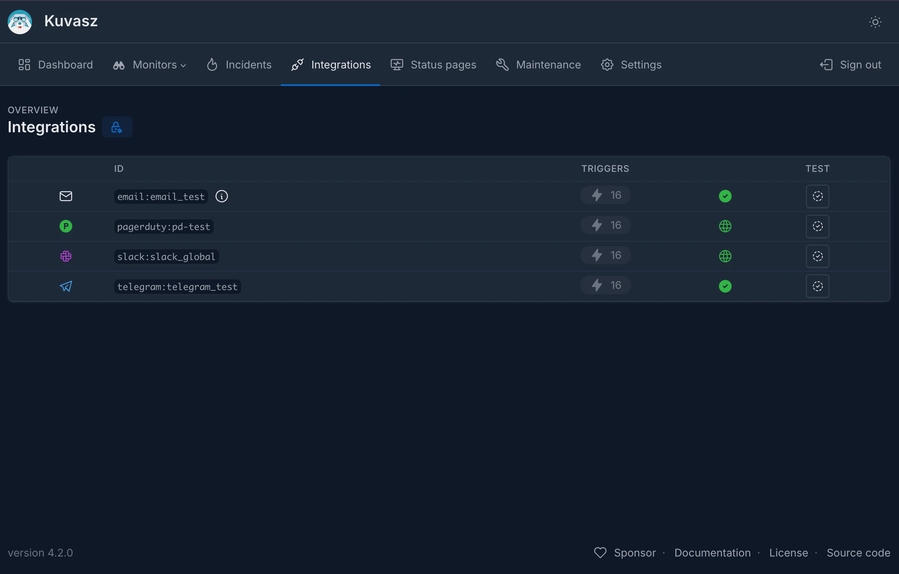

_Kuvasz_ provides a sleek and performant user interface that allows you to **manage your monitors**, view their status, and **access detailed information** about each monitor. The UI is designed to be intuitive and easy to use, making it simple to navigate through your monitoring setup.

- **NO** complex, bloated frontend frameworks
- **NO** unnecessary dependencies

Just a **clean and responsive interface** that works well on both desktop and mobile devices!

## Browser support

The UI relies on modern CSS features (`light-dark()`, `color-mix()`, `@property` and `:has()`), so it needs a recent browser:

| Browser             | Minimum version |
|---------------------|-----------------|
| Chrome / Edge       | 123             |
| Firefox             | 128             |
| Safari / iOS Safari | 17.5            |

!!! note

    Older browsers still render the pages, but colors, spacing and some interactive states will look off. This does **not** affect the [**API**](api.md) or the [**MCP server**](mcp-server.md) in any way.

## Dashboard

## Monitors

## Settings & Integrations

## Incidents

## Status pages

## Maintenance windows

