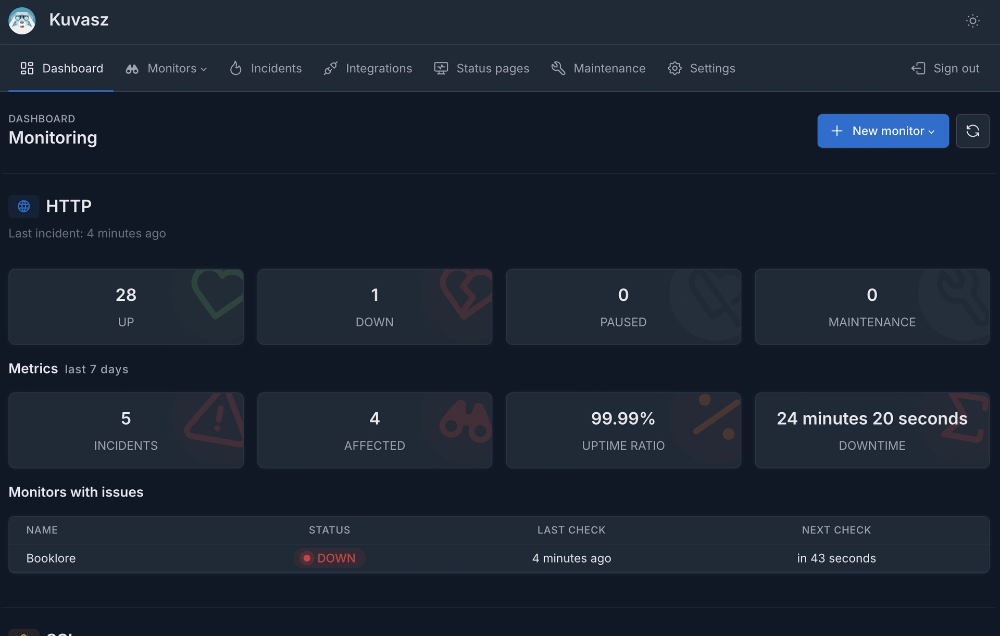

# 

<figure markdown="span">
  { width="350" .skip-lb }
  { width="350" .skip-lb }
  <figcaption>Welcome to <strong>Kuvasz</strong> [ˈkuvɒs], an open-source, self-hosted uptime & SSL monitoring service with status pages</figcaption>
</figure>

!!! tip "TL;DR"

    Do you want to try out _Kuvasz_ without installing it? There is a [**live demo**](demo.md) available!

    Are you looking for the **deployment guide**? You can find it [**here**](setup/installation.md)!

## Highlights

-   :green_circle:{ .lg .card-header-icon } __HTTP monitoring__

    ---

    With flexible configuration, adjustable intervals, headers, keyword matching, expected response status codes, response time checks and more.

    [:octicons-arrow-right-24: HTTP monitoring](features/http-monitoring.md)

-   :lock:{ .lg .card-header-icon } __SSL monitoring__

    ---

    Kuvasz checks your SSL certificates every day, and notifies you before they expire.

    [:octicons-arrow-right-24: SSL monitoring](features/ssl-monitoring.md)

-   :bell:{ .lg .card-header-icon } __Notifications__

    ---

    Supports multiple notification channels, currently including email, Slack, Discord, Telegram, and PagerDuty. You can configure the notification channels on a per-monitor basis.

    [:octicons-arrow-right-24: Notifications](features/notifications.md)

-   :earth_africa:{ .lg .card-header-icon } __API__

    ---

    Provides a fully-fledged REST API to manage your monitors, check their status, and more.

    [:octicons-arrow-right-24: API](features/api.md)

-   :bar_chart:{ .lg .card-header-icon } __Metrics Exporters__

    ---

    Export your metrics to _Prometheus_ or to any _OTLP-compatible_ tool, to integrate with your existing monitoring and alerting systems.

    [:octicons-arrow-right-24: Metrics exporters](management/metrics-exporters.md)

-   :sparkles:{ .lg .card-header-icon } __Sleek UI__

    ---

    Kuvasz has a modern, responsive, and user-friendly interface that makes it easy to manage your monitors.

    [:octicons-arrow-right-24: Web UI](features/ui.md)

-   :octicons-law-16:{ .lg .card-header-icon } __Free & Open Source__

    ---

    Kuvasz is licensed under the _Apache License 2.0_, it's free and it always will be.

    [:octicons-arrow-right-24: Sponsoring](https://ko-fi.com/L4L31DH59D){ target="_blank" }

-  :loudspeaker:{ .lg .card-header-icon } __Status Pages__

    ---

    You can create public and also private, brandable [status pages](https://demo.kuvasz-uptime.dev/status){ target="_blank" } for your monitors, to keep your customers or your internal team informed about the status of your services.

    [:octicons-arrow-right-24: Status Pages](features/status-pages.md)

-   :woman_cartwheeling:{ .lg .card-header-icon } __Flexible Configuration__

    ---

    You can choose how you would like to manage your monitors: on the UI, or via the API, or with a single YAML file.

    [:octicons-arrow-right-24: Flexibility](features/flexibility.md)

-   :cloud:{ .lg .card-header-icon } __Cloud Native__

    ---

    Kuvasz is built with cloud-native principles in mind, distributed as a single Docker image, and only requires a _PostgreSQL_ database to run.

    [:octicons-arrow-right-24: Getting started](setup/installation.md)

## Kuvasz vs. UptimeRobot

|                                           |    Kuvasz     | UptimeRobot Free | UptimeRobot Solo |
|-------------------------------------------|:-------------:|:----------------:|:----------------:|
| Price                                     |     Free      |       Free       |     $84/year     |
| Monitoring interval                       | **5 seconds** |    5 minutes     |    60 seconds    |
| Monitors limit                            | **unlimited** |        50        |        10        |
| Location-specific monitoring              |     ✅^1^      |        ❌         |        ✅         |
| Translations                              |       ✅       |        ❌         |        ❌         |
| Custom data retention                     |       ✅       |     3 months     |    12 months     |
| REST API                                  |       ✅       |        ✅         |        ✅         |
| Prometheus & OpenTelemetry exporters      |       ✅       |        ❌         |        ❌         |
| Backups & YAML configuration              |       ✅       |        ❌         |        ❌         |
| Status pages                              |       ✅       |      only 1      |      only 3      |
| Maintenance windows                       |      📆       |        ❌         |        ✅         |
| **HTTPs monitoring**                      |               |                  |                  |
| Keyword matching                          |       ✅       |        ✅         |        ✅         |
| Header matching                           |       ✅       |        ❌         |        ❌         |
| Slow response alerts                      |       ✅       |        ❌         |        ✅         |
| Custom HTTP methods                       |       ✅       |  ❌ (HEAD only)   |        ✅         |
| Custom status matcher                     |       ✅       |        ❌         |        ✅         |
| Custom headers                            |       ✅       |        ❌         |        ✅         |
| Custom request body                       |       ✅       |        ❌         |        ✅         |
| **SSL monitoring**                        |       ✅       |        ❌         |        ✅         |
| **Ping (ICMP) monitoring**                |      📆       |        ✅         |        ✅         |
| **Heartbeat monitoring**                  |      📆       |        ❌         |        ✅         |
| **Port monitoring**                       |       ❌       |        ✅         |        ✅         |
| **DNS monitoring**                        |       ❌       |        ❌         |        ✅         |
| **Domain expiration monitoring**          |       ❌       |        ❌         |        ✅         |
| **Notifications**                         |               |                  |                  |
| Email                                     |       ✅       |        ✅         |        ✅         |
| Discord                                   |       ✅       |        ✅         |        ✅         |
| Slack                                     |       ✅       |        ❌         |        ✅         |
| Telegram                                  |       ✅       |        ❌         |        ✅         |
| Pagerduty                                 |       ✅       |        ❌         |        ❌         |
| MS Teams                                  |      📆       |        ❌         |        ✅         |
| Webhook                                   |      📆       |        ❌         |        ❌         |
| SMS / Voice call                          |     📆^2^     |        ❌         |  10 incl./month  |
| Google Chat, Pushover, Pushbullet, Splunk |       ❌       |        ✅         |        ✅         |
| Mattermost                                |       ❌       |        ❌         |        ✅         |

✅ Supported | ❌ Not supported | 📆 Planned

- ^1^ You can deploy _Kuvasz_ to multiple locations and monitor your services from those locations, but it does not support location-specific monitoring out of the box.
- ^2^ _Kuvasz_ will only provide the integration, but you will need to pay for the SMS or voice call service yourself

## Don't miss out on the latest updates!

First and foremost, if you want to **stay up-to-date with the latest news**, features, and updates about _Kuvasz_, please consider:

- starring the project on [**GitHub**](https://github.com/kuvasz-uptime/kuvasz){ target="_blank" } and on [**Docker Hub**](https://hub.docker.com/r/kuvaszmonitoring/kuvasz){ target="_blank" }
- joining our [**Discord server**](https://discord.com/invite/hMkyGPyU32){ target="_blank" }
- following us on [**X**](https://x.com/KuvaszUptime){ target="_blank" }
- following us on [**Mastodon**](https://techhub.social/@KuvaszUptime){ target="_blank", rel="me" }

You can also find some occasional updates on my personal blog at [**akobor.me**](https://akobor.me){ target="_blank" }.

## Where does the name come from?

Kuvasz (pronounce as [ˈkuvɒs]) is an ancient hungarian breed of livestock & guard dog. You can read more about them
on [**Wikipedia**](https://en.wikipedia.org/wiki/Kuvasz){ target="_blank" }.

## Do you like it?

While _Kuvasz_ is free and open-source, it still requires a lot of time and effort to maintain and develop. If you like it, please consider our [**sponsoring**](sponsoring.md) options.
