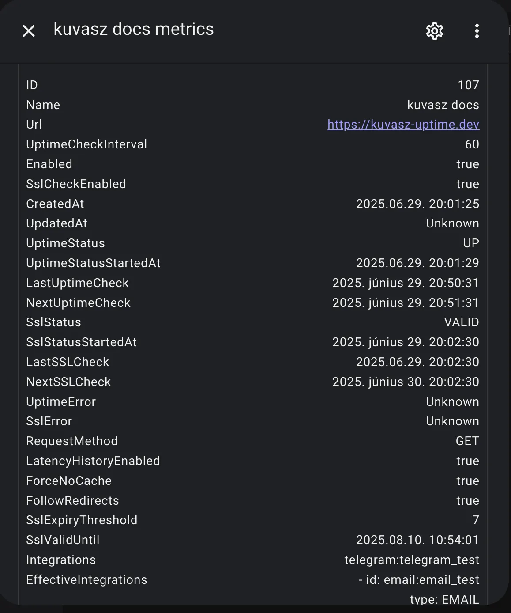
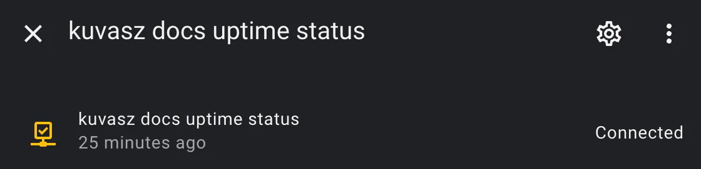

## Enable trace logging of HTTP requests/responses

If you want to **debug one of your monitors**, you can enable trace logging of HTTP requests and responses. This will log all the requests and responses made by _Kuvasz_ to  your monitors. All you need to do is to add the following configuration to your _YAML_ configuration file:

```yaml
logger:
  levels:
    io.micronaut.http.client: TRACE # (1)!
```

1. You can also use `DEBUG`, but it won't log the request and response bodies, only the headers and status codes.

## Home Assistant RESTful integration

_Kuvasz_ can be easily **integrated with Home Assistant** using the [_RESTful_](https://www.home-assistant.io/integrations/rest/){target="_blank"} integration by using its [API](../features/api.md). This allows you to create sensors for your most precious monitors and use them in your **automations, scripts**, or just to visualize the status of your monitors. You can even **build your own custom dashboard** with the data from your monitors!

!!! tip

    If you have the [authentication disabled](../setup/configuration.md#toggling-authentication), you can skip setting up your API key as a secret and you can also omit the `X-API-KEY` header in your requests.

### Define your secret in Home Assistant

```yaml title="secrets.yaml"
kuvasz_api_key: "ThisShouldBeVeryVerySecure"
```

### Sensor with JSON attributes

```yaml title="configuration.yaml"
sensor:
  - name: "kuvasz docs metrics"
    unique_id: metrics_kuvasz_docs
    platform: rest
    verify_ssl: false
    scan_interval: 60
    resource: http://kuvasz.home/api/v2/http-monitors/107
    headers:
      X-API-KEY: !secret kuvasz_api_key
    value_template: "OK"
    json_attributes:
      - id
      - name
      - url
      - uptimeCheckInterval
      - enabled
      - sslCheckEnabled
      - createdAt
      - updatedAt
      - uptimeStatus
      - uptimeStatusStartedAt
      - lastUptimeCheck
      - nextUptimeCheck
      - sslStatus
      - sslStatusStartedAt
      - lastSSLCheck
      - nextSSLCheck
      - uptimeError
      - sslError
      - requestMethod
      - latencyHistoryEnabled
      - forceNoCache
      - followRedirects
      - sslExpiryThreshold
      - sslValidUntil
      - integrations
      - effectiveIntegrations
```

**Result:**



### Binary sensor for uptime as `connectivity`

```yaml
binary_sensor:
  - name: "kuvasz docs uptime status"
    unique_id: uptime_kuvasz_docs
    platform: rest
    verify_ssl: false
    scan_interval: 60
    resource: http://kuvasz.home/api/v2/http-monitors/107
    headers:
      X-API-KEY: !secret kuvasz_api_key
    device_class: connectivity
    value_template: >
      
      {{ status == 'UP' }}
    availability: >
      {{ value_json.uptimeStatus is not none }}
```

**Result:**



## Exposing status pages on subdomains behind a reverse proxy

If you want to expose your status pages on subdomains (e.g. `status.yourdomain.com`), you can do so by using a reverse proxy (e.g. _Caddy_, _Nginx_, _Traefik_, etc.). Here is an example configuration for _Caddy_:

```yaml
status.your-domain.com {
    reverse_proxy {YOUR_KUVASZ_HOST}:8080
    rewrite /public/* {uri} # (1)!
    rewrite * /status{uri} # (2)!
}
```

1.  This is needed to serve the static assets (CSS, JS, images, etc.) correctly.
2.  This will rewrite all requests to `/status`, which is the path where the status pages are served.

The configuration snippet above exposes the default status page (that is located under `/status` on _Kuvasz_) on the root of the configured subdomain (i.e. `status.your-domain.com`), and also proxies the other status pages (e.g. `/status/your-custom-status-page`) on requesting `status.your-domain.com/your-custom-status-page`.

## Providing a custom root certificate for SSL checks

If you want to use a **custom root certificate** for SSL checks (e.g. if you're using a self-signed certificate, or a private CA), you can provide it by modifying the _Java Keystore_ (JKS) in use, to add your custom root certificate to it.

The advantage of this approach is, that you only need to do the following steps when:

- you have a new cert, or you would like to update the existing custom one
- we change the base image of the _Docker_ build (should not happen in the near future)
- we change the Java version in the project (happens really not that often)

Otherwise you can just use your own "patched" `cacerts` for every new version of Kuvasz.

### Preparing the custom `cacerts` file

```shell
# 1. Pull the current base image
docker pull eclipse-temurin:25-jre-alpine-3.23
# 2. Copy the "original" cacerts to a local file
docker run --rm --entrypoint cat eclipse-temurin:25-jre-alpine-3.23 /opt/java/openjdk/lib/security/cacerts > cacerts
# 3. This is the tricky step: we attach back the current folder where the cacerts, and also the custom certificate should exist and we add the custom certificate to the keystore
docker run --rm -v `pwd`:/tmp/certs eclipse-temurin:25-jre-alpine-3.23 sh -c 'cd /tmp/certs && keytool -keystore cacerts -storepass changeit -noprompt -trustcacerts -importcert -alias your-custom-alias -file your-custom-cert.crt'
```

Watch out for `your-custom-alias` and `your-custom-cert.crt` in the example, these are the moving parts, depending on your own preferences.

### Attaching the modified `cacerts` to Kuvasz

This is easier, and quite straightforward, you just need to mount another volume with your `cacerts` file from the steps above:

```yaml
# ...
volumes:
  - /path/to/your/cacerts:/opt/java/openjdk/lib/security/cacerts:ro
# ...
```
Make sure that you completely re-create your container after these changes!

## Backup & Restore with YAML

It might be useful to create sometimes a backup from your monitors and status pages in case you didn't configure them via a YAML file, because later you might want to switch to that method, or you just want to make it possible to restore them in case of an accidental deletion, for example.

1. To do so, you can use the **Web UI** (_Settings > Backup & Restore_) or the **API** ([Monitors](https://api-docs.kuvasz-uptime.dev/#tag/Monitors/operation/getYamlMonitorsExport_1){target="_blank"}, [Status pages](https://api-docs.kuvasz-uptime.dev/#tag/Status-pages/operation/getYamlStatusPagesExport){target="_blank"}).
The response in both cases will be **a _YAML_ file, which you can save to a safe place**. 
2. To restore those files, you can just simply **copy the content of them as-is into your own YAML configuration file**, and restart your instance of _Kuvasz_.
3. If you would like to **continue using the UI or the API** to manage your monitors and status pages, you need to remove the corresponding sections from your YAML configuration file after the successful restore and restart your instance once again. After that, you should be able to manage everything via the UI or the API as before.

## Full YAML example (app-config + monitors + integrations)

This is just a full example of a _YAML_ configuration file, which you can use as a **starting point** for your own configuration. You can copy and paste it into your own configuration file, and then modify it to suit your needs, but always make sure that **you read the corresponding documentation** sections for each feature or integration you want to use.

!!! warning

    Be aware that if you define your monitors or your status pages via _YAML_, you **cannot use the Web UI** to modify them, you can only view them there!

```yaml
micronaut.security.enabled: true
micronaut.security.token.generator.access-token.expiration: 86400 # 24 hours
admin-auth:
  username: YourSuperSecretUsername
  password: YourSuperSecretPassword
  api-key: ThisShouldBeVeryVerySecureToo
app-config:
  event-data-retention-days: 365
  latency-data-retention-days: 7
  log-event-handler: true
  language: en
  check-updates: true
  http-check-timeout-seconds: 30
---
smtp-config:
  host: 'your.smtp.server'
  port: 465
  transport-strategy: SMTP_TLS
  username: YourSMTPUsername
  password: YourSMTPPassword
---
integrations:
  pagerduty:
    - name: pd_global
      integration-key: YourOwnIntegrationKey
      global: true
      enabled: true
  slack:
    - name: slack_default
      webhook-url: 'https://hooks.slack.com/services/T00000000/B00000000/XXXXXXXXXXXXXXXX'
  discord:
    - name: discord
      webhook-url: https://discord.com/api/webhooks/XXXXXXX/YYYYYYYYY
  email:
    - name: email_implicitly_enabled
      from-address: noreply@kuvasz-uptime.dev
      to-address: your@email.address
  telegram:
    - name: telegram_disabled
      api-token: 'YourToken'
      chat-id: '-1232642423121'
      enabled: false
---
http-monitors:
  - name: "full configuration example"
    url: "https://akobor.me"
    uptime-check-interval: 30
    enabled: true
    ssl-check-enabled: false
    request-method: "POST"
    latency-history-enabled: true
    follow-redirects: true
    force-no-cache: true
    ssl-expiry-threshold: 30
    integrations:
      - "telegram:telegram_disabled"
      - "slack:slack_default"
    expected-status-codes:
      - 200
      - 201
      - 303
    expected-keyword: "akobor"
    expected-keyword-case-sensitive: true
    expected-keyword-negated: false
    response-time-threshold-millis: 500
    request-headers:
      Host: "example.com"
    expected-headers:
      Content-Type: "application/json"
    request-body: "{\"key\":\"value\"}"
  - name: "minimal configuration example"
    url: "https://kuvasz-uptime.dev"
    uptime-check-interval: 5
push-monitors:
  - name: "My Push Monitor"
    heartbeat-interval: 10
    grace-period: 2
    client-secret: "d6d5a85c-82c0-4bea-9926-c3eed32de32b"
    enabled: true
    integrations: [ ]
  - name: "Another Push Monitor"
    heartbeat-interval: 86400
    grace-period: 3600
    client-secret: "7b2d5cb1-41bd-4067-9732-c79dbbf45286"
    enabled: false
    integrations:
      - "slack:slack_default"
---
default-status-page:
  public: true
  title: "Status - Kuvasz Uptime"
  custom-logo-url: "https://example.com/logo.png"
  custom-favicon-url: "https://example.com/favicon.png"
status-pages:
  - title: "Example Status Page"
    slug: "example-status"
    public: true
    custom-logo-url: "https://example.com/logo.png"
    custom-favicon-url: "https://example.com/favicon.png"
    monitors:
      - "http:full configuration example"
      - "http:minimal configuration example"
      - "push:My Push Monitor"
```
