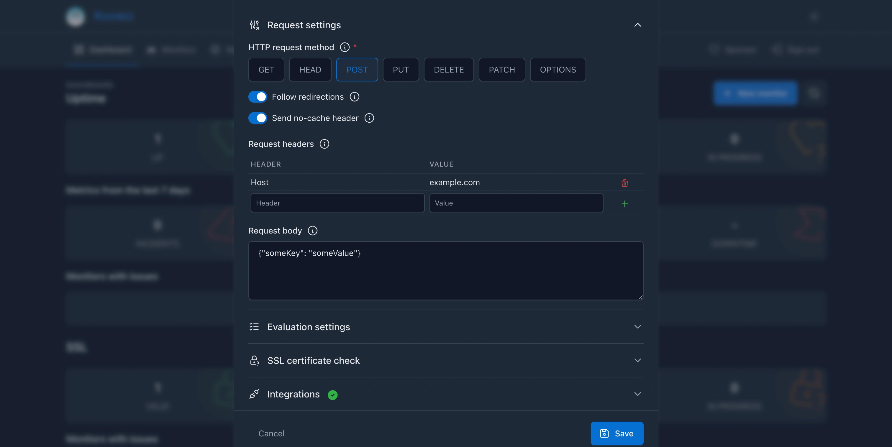

!!! tip "Before you start..."

    Make sure that you **carefully read the** [**common documentation**](managing-monitors/index.md) about managing the monitors!

## Management methods

=== "Web UI (recommended)"

    If you navigate to the Web UI of _Kuvasz_, you can create a new monitor on the **Dashboard**, or on the **Monitors** page, by clicking the "+ New Monitor" button in the page header.

    

=== "YAML (advanced)"

    ```yaml title="YAML monitor reference"
    http-monitors:
    - name: "My Monitor" # (1)!
      url: "https://kuvasz-uptime.dev" # (2)!
      uptime-check-interval: 60 # (3)!
      enabled: true # (4)!
      ssl-check-enabled: false # (5)!
      latency-history-enabled: true # (6)!
      request-method: "GET" # (7)!
      follow-redirects: true # (8)!
      force-no-cache: true # (9)!
      ssl-expiry-threshold: 30 # (10)!
      expected-status-codes: # (12)!
        - 200
        - 201
        - 303
      expected-keyword: "Kuvasz" # (13)!
      expected-keyword-case-sensitive: false # (14)!
      expected-keyword-negated: false # (15)!
      response-time-threshold-millis: 500 # (16)!
      request-headers: # (17)!
        Host: "example.com"
      expected-headers: # (18)!
        Content-Type: "application/json"
      request-body: "{\"key\":\"value\"}" # (19)!
      integrations: # (11)!
        - "email:my-email-integration"
    # ... other monitors
    ```

    1. **Name**: The name of the monitor, which must be unique.
    2. **URL**: The URL of the monitor, which is the endpoint that will be monitored.
    3. **Uptime check interval**: The interval in seconds at which the uptime checks will be performed. The **minimum value is 5 seconds**.
    4. **Enabled**: Whether the monitor is enabled or not. If it's disabled, it won't be checked, and no events will be recorded for it.
    5. **SSL check enabled**: Whether the SSL check is enabled or not. If it's disabled, the monitor won't check the SSL certificate.
    6. **Latency history enabled**: Whether the latency history is enabled or not. If it's disabled, the monitor won't record latency history.
    7. **Request method**: The HTTP method to use for the uptime checks (e.g. GET, HEAD, etc.). Defaults to GET.
    8. **Follow redirects**: Whether the monitor should follow redirects or not. Defaults to true.
    9. **Force no cache**: Whether the monitor should send a `Cache-Control: no-cache` header with the request. Defaults to true.
    10. **SSL expiry threshold**: The number of days before the SSL certificate expires that the monitor should alert about it. Defaults to 30 days.
    11. **Integrations**: A list of integrations to assign to the monitor. The format is `"{integration-type}:{integration-name}"`, where `integration-type` is the type of the integration (e.g. `email`, `slack`, etc.), and `integration-name` is the name of the integration as defined in the `integrations` section of your YAML file. Example: `email:my-email-integration`.
    12. **Expected status codes**: A list of expected HTTP status codes that the monitor should accept as valid responses. Defaults to any `2xx` status, see [supported codes](#expected-status-codes).
    13. **Expected keyword**: A keyword that the monitor should look for in the response body. If the keyword is not found, the monitor will alert you about it.
    14. **Expected keyword case sensitive**: Whether the keyword matching should be case-sensitive or not. Defaults to false.
    15. **Expected keyword negated**: Whether the keyword matching should be negated or not. If set to true, the monitor will alert you if the keyword is found in the response body. Defaults to false.
    16. **Response time threshold**: The maximum response time in milliseconds that the monitor should accept. If the response time is higher than this value, the monitor will alert you about it. Maximum is 30 seconds (30000 ms), default is `null` which means that there is no response time threshold.
    17. **Request headers**: A map of request headers to send with the request. This is useful if you need to set specific headers for the request, like `Host`, `Authorization`, etc.
    18. **Expected headers**: A map of expected response headers that the monitor should check for in the response.
    19. **Request body**: The JSON request body to send with the request.

=== "API (expert)"

    This section won't go into details about the API or about exact API calls, since it's **well documented and must be self-explanatory**. You can find more information about the available endpoints and their usage in the [**API documentation**](https://api-docs.kuvasz-uptime.dev){target="_blank"}.

    However, here are **few of the most important** endpoints:

    - `GET /api/v2/http-monitors` – List all HTTP monitors
    - `GET /api/v2/http-monitors/{id}` – Get a specific HTTP monitor by its ID
    - `POST /api/v2/http-monitors` – Create a new HTTP monitor
    - `PATCH /api/v2/http-monitors/{id}` – Update an existing HTTP monitor
    - `DELETE /api/v2/http-monitors/{id}` – Delete an HTTP monitor

## Basic settings

### Name

<!-- md:flag required -->
<!-- md:type string -->
<!-- md:yaml_prop `name` -->

The name of the monitor, which **must be unique** across all monitors.

### URL

<!-- md:flag required -->
<!-- md:type string -->
<!-- md:yaml_prop `url` -->

The URL of the monitor, which is **the endpoint that will be monitored**. It can be an HTTP or HTTPS URL.

### Uptime check interval

<!-- md:flag required -->
<!-- md:type number -->
<!-- md:yaml_prop `uptime-check-interval` -->

The interval **in seconds** at which the uptime checks will be performed. The **minimum value is 5 seconds**.

### Enabled

<!-- md:default `true` -->
<!-- md:type boolean -->
<!-- md:yaml_prop `enabled` -->

Whether the monitor is enabled or not. If it's disabled, it won't be checked, and **no events will be recorded** for it. Also disables SSL checks, because it **toggles the whole monitor**.

### Latency history enabled

<!-- md:version 2.0.0 -->
<!-- md:default `true` -->
<!-- md:type boolean -->
<!-- md:yaml_prop `latency-history-enabled` -->

Whether the latency history is enabled or not. If it's disabled, the monitor **won't record the measured latency**. If you disable it on a monitor that has already recorded latency history, the **existing history will be deleted**.

## Request settings

### Request method

<!-- md:version 2.0.0 -->
<!-- md:default `GET` -->
<!-- md:type enum -->
<!-- md:yaml_prop `request-method` -->

The **HTTP method** to use for the uptime checks.

!!!info "Supported methods"

    The supported methods are:

    - `GET`, `HEAD` - since [2.0.0](../changelog.md#2.0.0)
    - `POST`, `PUT`, `PATCH`, `DELETE`, `OPTIONS` - since [2.5.0](../changelog.md#2.5.0)

!!!warning "Consequences of certain methods"

    - If you use the `HEAD` method, the response body will be empty, so the [**expected keyword check**](#expected-keyword) will always fail.
    - If you would like to send a [**request body**](#request-body), you must use the `POST`, `PUT`, or `PATCH` methods.

### Follow redirects

<!-- md:version 2.0.0 -->
<!-- md:default `true` -->
<!-- md:type boolean -->
<!-- md:yaml_prop `follow-redirects` -->

Whether the monitor **should follow redirects** or not. If it's disabled, the monitor will **not follow HTTP redirects** (`3xx` responses) and will only check the initial URL. Multiple redirects will be followed, and the final response will be checked, however if a redirect loop is detected, the monitor will fail and alert you about it.

### Force no-cache header

<!-- md:version 2.0.0 -->
<!-- md:default `true` -->
<!-- md:type boolean -->
<!-- md:yaml_prop `force-no-cache` -->

Whether the monitor should send a `Cache-Control: no-cache` header with the request. This is useful to ensure that the **response is not cached by the server** or any intermediate proxies, and you always get the latest response.

### Request headers

<!-- md:version 2.5.0 -->
<!-- md:type map -->
<!-- md:yaml_prop `request-headers` -->

A set of request headers to send with the request. This is useful if you need to set **specific headers for the request**, like `Host`, `Authorization`, etc. The headers will be sent as-is, without any parsing, the only requirement is that the keys must be valid HTTP header names (starting with a letter and containing only letters, digits or dashes).

!!! info "Default headers"

    _Kuvasz_ will automatically add the following headers to every request:

    - `User-Agent`: `Kuvasz Uptime Checker/2 https://github.com/kuvasz-uptime/kuvasz`
    - `Accept`: `*/*`
    - `Accept-Encoding`: `gzip, deflate, br` (only if there is no [keyword matcher](#expected-keyword) defined)
    - `Host`: the host part of the URL being monitored
    - `Cache-Control`: `no-cache` (if the [**force no-cache header**](#force-no-cache-header) option is enabled)

    If you define any of these headers along your custom request headers, they **will be overridden** by your values!

### Request body

<!-- md:version 2.5.0 -->
<!-- md:type string -->
<!-- md:yaml_prop `request-body` -->

The JSON request body to send with the request. This is useful if you need to **send a specific payload with the request**. The body will be sent as-is, without any sanitization, trimming or parsing, the only requirement is that it must be a valid JSON string.

**Supported request methods**: `POST`, `PUT` and `PATCH`

!!!info

    If you use one of the supported request methods and you don't provide a request body, an **empty JSON object** (`{}`) will be sent as the request body by default.

## Evaluation settings

### Expected status codes

<!-- md:version 2.4.0 -->
<!-- md:default `every 2xx code` -->
<!-- md:type list -->
<!-- md:yaml_prop `expected-status-codes` -->

A list of **expected HTTP status codes** that the monitor should accept as valid responses. If the response status code is not in this list, the monitor will alert you about it. Defaults to any `2xx` status code.

??? info "Supported status codes"

    **Informational**:

    - `100` Continue
    - `101` Switching Protocols
    - `102` Processing
    - `103` Early Hints

    **Success**:

    - `200` Ok
    - `201` Created
    - `202` Accepted
    - `203` Non-Authoritative Information
    - `204` No Content
    - `205` Reset Content
    - `206` Partial Content
    - `207` Multi Status
    - `208` Already Imported
    - `226` IM Used

    **Redirection**:

    - `300` Multiple Choices
    - `301` Moved Permanently
    - `302` Found
    - `303` See Other
    - `304` Not Modified
    - `305` Use Proxy
    - `306` Switch Proxy
    - `307` Temporary Redirect
    - `308` Permanent Redirect

    **Client Error**:

    - `400` Bad Request
    - `401` Unauthorized
    - `402` Payment Required
    - `403` Forbidden
    - `404` Not Found
    - `405` Method Not Allowed
    - `406` Not Acceptable
    - `407` Proxy Authentication Required
    - `408` Request Timeout
    - `409` Conflict
    - `410` Gone
    - `411` Length Required
    - `412` Precondition Failed
    - `413` Request Entity Too Large
    - `414` Request-URI Too Long
    - `415` Unsupported Media Type
    - `416` Requested Range Not Satisfiable
    - `417` Expectation Failed
    - `418` I am a teapot (RFC 7168)
    - `420` Enhance your calm (Twitter)
    - `421` Misdirected Request (RFC 7540)
    - `422` Unprocessable Entity (WebDAV; RFC 4918)
    - `423` Locked (WebDAV; RFC 4918)
    - `424` Failed Dependency (WebDAV; RFC 4918)
    - `425` Too Early (RFC 8470)
    - `426` Upgrade Required (RFC 7231)
    - `428` Precondition Required (RFC 6585)
    - `429` Too Many Requests (RFC 6585)
    - `431` Request Header Fields Too Large (RFC 6585)
    - `444` No Response
    - `450` Blocked by Windows Parental Controls (Microsoft)
    - `451` Unavailable For Legal Reasons (RFC 7725)
    - `494` Request Header Too Large

!!! warning "Redirects"

    If the monitor is set to follows redirects, **every intermediate request's status code** will be checked against this list. 

    Therefore if you want to allow redirects, and you would also like to explicitly specify the expected status codes, you have to **add the right `3xx` status codes to this list** as well, otherwise the monitor will alert you about the redirect responses.

    For example: you have a monitor that checks a URL that redirects to another URL with a `307 Temporary Redirect`, and the final request is expected to return a `204 No Content` response. In this case you need to do the following:

    - enable the [**following redirects**](#follow-redirects) option
    - add `307` and `204` to the `expected-status-codes` list

### Expected keyword

<!-- md:version 2.4.0 -->
<!-- md:type string -->
<!-- md:yaml_prop `expected-keyword` -->

A keyword that the monitor should look for in the response body. If the **keyword is not found**, the monitor will alert you about it. This is useful to ensure that the response contains the expected content. You can use **JSON strings** as well, for example `{"status":"ok"}` to match a JSON response, but keep in mind, that _Kuvasz_ will check the response as is, without parsing it, so the keyword **must match exactly**.

!!! warning "HEAD requests"

    If the monitor is set to use the `HEAD` request method, the response body will be empty, so this check will always fail. In this case, you should either use the `GET` method, or disable this check.

### Expected keyword case sensitivity

<!-- md:version 2.4.0 -->
<!-- md:default `false` -->
<!-- md:type boolean -->
<!-- md:yaml_prop `expected-keyword-case-sensitive` -->

Whether the keyword matching should be **case-sensitive** or not. If it's set to `true`, the monitor will be considered healthy only if the keyword matches exactly, including the case. If it's set to `false`, the monitor will be considered healthy if the keyword is found in the response body, regardless of the case.

### Expected keyword negation

<!-- md:version 2.4.0 -->
<!-- md:default `false` -->
<!-- md:type boolean -->
<!-- md:yaml_prop `expected-keyword-negated` -->

A.k.a. _"reverse matching"_. If this is set to `true`, the monitor will alert you if the keyword is found in the response body, instead of alerting you if it's not found. This is useful if you want to ensure that a specific keyword is **not present** in the response body.

### Response time threshold

<!-- md:version 2.4.0 -->
<!-- md:type number -->
<!-- md:yaml_prop `response-time-threshold-millis` -->

The maximum response time in **milliseconds** that the monitor should accept. If the response time is higher than this value, the monitor will alert you about it. This is useful to ensure that your services are performing well and responding within an acceptable time frame. The maximum value is 30 seconds (30000 ms), and the default is `null`, which means that there is no response time threshold.

### Expected headers

<!-- md:version 2.5.0 -->
<!-- md:type map -->
<!-- md:yaml_prop `expected-headers` -->

A set of expected response headers that the monitor should check for in the response. If any of the **expected headers are missing or have different values**, the monitor will alert you about it. The header names will be checked in a case-insensitive manner, but the values will be checked as-is, without any parsing, trimming or normalization. The keys must be valid HTTP header names (starting with a letter and containing only letters, digits or dashes).

## SSL check settings

### SSL check enabled

<!-- md:default `false` -->
<!-- md:type boolean -->
<!-- md:yaml_prop `ssl-check-enabled` -->

Whether the SSL check is enabled or not. If it's disabled, the monitor **won't check the SSL certificate**. This setting is probably only relevant for HTTPS URLs.

### SSL expiry threshold

<!-- md:version 2.0.0 -->
<!-- md:default `30` -->
<!-- md:type number -->
<!-- md:yaml_prop `ssl-expiry-threshold` -->

The **number of days before the SSL certificate expires** that the monitor should alert about it. **Minimum value is 0**, which mean that the monitor will alert you only on the day of the expiry.

!!!tip "Using Let's Encrypt?"

    If you're using _Let's Encrypt_ certificates, you can set this to a lower value, like 20 days, because most of the automated renewal tools **will renew the certificate** at least **30 days before** the expiry date, so you will be notified only if something goes wrong with the automated renewal process.

## Integrations <!-- md:config ../management/integrations.md -->

<!-- md:version 2.0.0 -->
<!-- md:default empty -->
<!-- md:type list -->
<!-- md:yaml_prop `integrations` -->

A list of **integrations to assign** to the monitor. 

If you're using YAML, or the API, the format is `"{type}:{name}"`, where `type` is the alias of the integration (e.g. `email`, `slack`, etc.), and `name` is the name of the integration as defined in the [**`integrations` section of your YAML file**](../management/integrations.md). Example: `email:my-email-integration`.

!!!tip
    
    You can add/keep **disabled integrations in the list**, but they will not be used for the monitor. This is useful if you want to enable them later without modifying the monitor's configuration.

    **Global integrations** can be explicitly added too, which is handy if you're about to **make them non-global later**, but you want to make sure that they will be assigned to certain monitors even after the change.

## Common operations

### Toggling a monitor

You can **enable or disable a monitor** at any time, which will toggle the whole monitor, including the SSL checks and latency history. This is useful if you want to temporarily stop monitoring a specific endpoint without deleting it.

Disabled monitors **won't be counted in the cumulated metrics**, like uptime ratio.

=== "Web UI (recommended)"

    Look for the **toggle switches** with the :material-pause: sign.

=== "YAML (advanced)"

    Set the `enabled` field to `true` or `false` in your YAML file.

    ```yaml hl_lines="4"
    http-monitors:
    - name: "My Monitor"
      url: "https://kuvasz-uptime.dev"
      enabled: false
    ```

=== "API (expert)"

    Use the `PATCH /api/v2/http-monitors/{id}` endpoint to update the `enabled` field of the monitor.

### Deleting a monitor

If you delete a monitor, it will be **removed** from the database, and **all of its recorded events and metrics** (i.e. latency history, uptime checks, etc.) will be deleted as well. This is a **destructive operation**, so make sure you really want to delete the monitor.

=== "Web UI (recommended)"

    Look for the **delete button** with the :material-trash-can: sign next to the monitor you want to delete.

=== "YAML (advanced)"

    **Remove the monitor from your YAML** file, and then restart _Kuvasz_ to apply the changes.

=== "API (expert)"

    Use the `DELETE /api/v2/http-monitors/{id}` endpoint to delete the monitor by its ID.

### Modifying the assigned integrations

=== "Web UI (recommended)"

    You can modify the assigned integrations of a monitor by clicking on the **configure button** with the :material-cog: sign on the **monitor's detail page** (look for the _Integrations_ block), where you can add or remove integrations as needed.

=== "YAML (advanced)"

    Modify the `integrations` property of your affected monitor, by adding or removing list items, and then restart _Kuvasz_ to apply the changes.

    ```yaml hl_lines="5"
    http-monitors:
    - name: "My Monitor"
      url: "https://kuvasz-uptime.dev"
      uptime-check-interval: 60
      integrations:
        - "email:my-email-integration"
        - "slack:my-slack-integration"
    ```

=== "API (expert)"

    Use the `PATCH /api/v2/http-monitors/{id}` endpoint to update the `integrations` field of the monitor. You can add or remove integrations as needed.

    ```json
    {
      "integrations": [
        "email:my-email-integration",
        "slack:my-slack-integration"
      ]
    }
    ```
