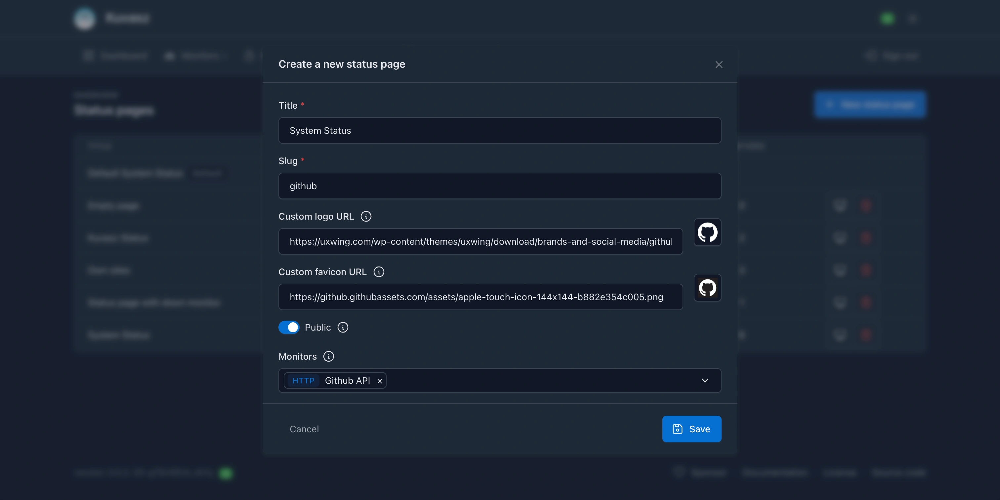

## Management methods

=== "Web UI (recommended)"

    If you navigate to the Web UI of _Kuvasz_, you can create a new status page on the **Status pages** page, by clicking the "+ New status page" button in the page header.

    

=== "YAML (advanced)"

    ```yaml title="YAML status page reference"
    # Default status page configuration
    default-status-page: # (1)!
      public: true
      title: "Status - Kuvasz Uptime"
      custom-logo-url: "https://example.com/logo.png"
      custom-favicon-url: "https://example.com/favicon.png"
    status-pages: # (2)!
      - title: "Example Status Page" # (3)!
        slug: "example-status" # (4)!
        public: true # (5)!
        custom-logo-url: "https://example.com/logo.png" # (6)!
        custom-favicon-url: "https://example.com/favicon.png" # (7)!
        monitors: # (8)!
          - "http:My monitor 1"
          - "http:My monitor 2"
          - "push:My backup 1"
          - "icmp:My ICMP Monitor"
      # ... other status pages
    ```

    1. The default status page has a special section in the YAML configuration, since you can only have one default status page. Also, it's only configurable from YAML, you can't create or modify it from the Web UI or through the API.
    2. The `status-pages` section contains a list of custom status pages.
    3. The `title` field is the title of the status page, it will be displayed in the browser tab and also on the page itself.
    4. The `slug` field is the URL slug of the status page, it will be used to access the page.
    5. The `public` field determines whether the status page is public or private.
    6. The `custom-logo-url` field is the URL of the custom logo to be displayed on the status page.
    7. The `custom-favicon-url` field is the URL of the custom favicon to be used for the status page.
    8. The `monitors` field is a list of monitors to be displayed on the status page. You can reference monitors by their type and name, in the format `<type>:<name>`, e.g., `http:My HTTP Monitor`, `push:My backup 1`, `icmp:My ICMP Monitor`.

    !!!info "Consequences of describing your status pages as YAML"

        Be aware that if you define your status pages via _YAML_, you **cannot use the UI, or the API** to modify them, you can only view them there (read-only operations are permitted)!
    
        In this case _Kuvasz_ reads your YAML file on startup, compares the pages in there with the existing ones in the database, and uses the YAML file as the source of truth. 
    
        The same applies if you **used the UI or the API before** to manage your status pages, and you decide to switch to YAML: unless your YAML definition matches the existing status by their name, existing status pages **could be deleted or modified**.

    **What happens if you add one or more status page to your YAML file?**

    - If there is a status page in the database that is not in the YAML file, **it will be deleted**.
    - If there is a status page in the YAML file that is not in the database, **it will be created** and added to the database.
    - If there is a status page in both the YAML file and the database, and they have the same name, the status page in the database **will be updated** with the values from the YAML file.

    **What happens if you provide an empty array for the status pages in the YAML file?**

    ```yaml
    status-pages: []
    ```

    In this case all status pages in the database **will be deleted**.

    **What happens if you remove the relevant properties from the YAML file?**

    By that we mean that your YAML file **doesn't contain the relevant property key** (i.e. `status-pages`), or it is **not explicitly set to an empty array** (see the example below).

    ```yaml
    # Watch out for the missing property value here. 
    # This is considered as a missing configuration, 
    # entries in the database will not be touched, 
    # external write to the status pages are allowed.
    status-pages:
    ```

    In this case all status pages in the database **will be kept** (i.e. the ones that were created before via YAML). This is especially useful if you want to **restore your status pages from your exported YAML backup**, but you want to manage them on the UI in the future.

    !!!danger "Changing a status page's name"

        **If you change the name** of an existing status page in the YAML file, it will be treated as a new one, and the old one will be deleted.

=== "API (expert)"

    This section won't go into details about the API or about exact API calls, since it's **well documented and must be self-explanatory**. You can find more information about the available endpoints and their usage in the [**API documentation**](https://api-docs.kuvasz-uptime.dev){target="_blank"}.

    However, here are **few of the most important** endpoints:

    - `GET /api/v2/status-pages` – List all status pages
    - `GET /api/v2/status-pages/{id}` – Get a specific status page by its ID
    - `POST /api/v2/status-pages` – Create a new status page
    - `PATCH /api/v2/status-pages/{id}` – Update an existing status page
    - `DELETE /api/v2/status-pages/{id}` – Delete a status page by its ID

## The default status page

The default status page is a special, built-in status page that **automatically includes all enabled monitors**. It cannot be deleted or created manually, but you can unpublish it (i.e. make it private) if you don't want to use it.

### Title

<!-- md:version 3.1.0 -->
<!-- md:default System status -->
<!-- md:type string -->
<!-- md:yaml_prop `title` -->

=== "YAML"

    ```yaml hl_lines="3"
    default-status-page:
      # ...
      title: "Your desired title"
      # ...
    ```

=== "ENV"

    ```bash
    DEFAULT_STATUS_PAGE_TITLE=Your desired title
    ```

The **visible title** of the default status page, it will be displayed in the browser tab and also on the page itself.

### Public access

<!-- md:version 3.1.0 -->
<!-- md:default false -->
<!-- md:type boolean -->
<!-- md:yaml_prop `public` -->

=== "YAML"

    ```yaml hl_lines="3"
    default-status-page:
      # ...
      public: false
      # ...
    ```

=== "ENV"

    ```bash
    PUBLISH_DEFAULT_STATUS_PAGE=false
    ```

Determines whether the default status page is **publicly accessible** or not. If set to `false`, only authenticated users will be able to access it.

### Custom logo URL

<!-- md:version 3.1.0 -->
<!-- md:type string -->
<!-- md:yaml_prop `custom-logo-url` -->

=== "YAML"

    ```yaml hl_lines="3"
    default-status-page:
      # ...
      custom-logo-url: "https://example.com/logo.png"
      # ...
    ```

=== "ENV"

    ```bash
    DEFAULT_STATUS_PAGE_LOGO_URL=https://example.com/logo.png
    ```

The URL of the **custom logo** to be displayed on the default status page, next to the title. If not set, the default _Kuvasz_ logo will be used.

### Custom favicon URL

<!-- md:version 3.1.0 -->
<!-- md:type string -->
<!-- md:yaml_prop `custom-favicon-url` -->

=== "YAML"

    ```yaml hl_lines="3"
    default-status-page:
      # ...
      custom-favicon-url: "https://example.com/favicon.png"
      # ...
    ```

=== "ENV"

    ```bash
    DEFAULT_STATUS_PAGE_FAVICON_URL=https://example.com/favicon.png
    ```

The URL of the **custom favicon** to be used for the default status page. If not set, the default _Kuvasz_ favicon will be used.

## Custom status pages

You can create **multiple custom status pages**, each with its own configuration and set of monitors. Custom status pages can be created, modified, and deleted via the _Web UI_, the _REST API_, or by defining them in the _YAML_ configuration file.

### Title

<!-- md:version 3.1.0 -->
<!-- md:flag required -->
<!-- md:type string -->
<!-- md:yaml_prop `title` -->

The **visible title** of the default status page, it will be displayed in the browser tab and also on the page itself.

### Slug

<!-- md:version 3.1.0 -->
<!-- md:flag required -->
<!-- md:type string -->
<!-- md:yaml_prop `slug` -->

The **URL slug** of the custom status page, it will be used to access the page. The full URL will be in the format: `http(s)://<your-domain-or-ip>/status/<slug>`. The slug **must be unique** among all status pages and can contain only lowercase letters, numbers, hyphens (`-`), and underscores (`_`), maximum length is 50 characters.

### Public access

<!-- md:version 3.1.0 -->
<!-- md:default false -->
<!-- md:type boolean -->
<!-- md:yaml_prop `public` -->

Whether the custom status page is **publicly accessible** or not. If set to `false`, only authenticated users will be able to access it.

### Custom logo URL

<!-- md:version 3.1.0 -->
<!-- md:type string -->
<!-- md:yaml_prop `custom-logo-url` -->

The URL of the **custom logo** to be displayed on the custom status page, next to the title. If not set, the default _Kuvasz_ logo will be used.

### Custom favicon URL

<!-- md:version 3.1.0 -->
<!-- md:type string -->
<!-- md:yaml_prop `custom-favicon-url` -->

The URL of the **custom favicon** to be used for the custom status page. If not set, the default _Kuvasz_ favicon will be used.

### Monitors

<!-- md:version 3.1.0 -->
<!-- md:default empty -->
<!-- md:type list -->
<!-- md:yaml_prop `monitors` -->

A list of **monitors to assign** to the status page.

If you're using YAML, or the API, the format is `"{type}:{name}"`, where `type` is the alias of the monitor's type, and `name` is the name of the monitor. The supported types are `http`, `push`, and `icmp`. Example: `http:My HTTP Monitor`, `push:My backup 1`, `icmp:My ICMP Monitor`.

!!!tip

    You can add/keep **disabled monitors in the list**, but they will not be visible on the status page. This is useful if you want to enable them later without modifying the status page's configuration.

## Caching

<!-- md:version 3.1.0 -->

!!! info 
    
    The cache of the status pages is only configurable via _YAML_ or through _environment variables_.

Every status page is **cached on the server-side** by default, to improve performance and reduce server load. The default configuration should be sufficient for most use cases, but if you want to fine-tune it, you can do so by modifying the following settings.

### Configuration reference and default values

=== "YAML"

    ```yaml
    micronaut:
      caches:
        default-status-page:
          expire-after-write: PT5M # (1)!
        status-pages:
          expire-after-write: PT5M # (2)!
          maximum-size: 20 # (3)!
    ```

    1. The lifetime of the cache for the **default status page** in ISO-8601 duration format. Default is `PT5M` (5 minutes).
    2. The lifetime of the cache for **custom status pages** in ISO-8601 duration format. Default is `PT5M` (5 minutes).
    3. The maximum number of custom status pages to be cached. Default is `20`, which should be sufficient for most use cases. If you have more than 20 custom status pages, you can inrease this value, but keep in mind that it might have a negative impact on overall performance.

=== "ENV"

    ```bash
    DEFAULT_STATUS_PAGE_CACHE_EXPIRES_AFTER=PT5M # (1)!
    STATUS_PAGE_CACHE_EXPIRES_AFTER=PT5M # (2)!
    STATUS_PAGE_CACHE_MAX_SIZE=20 # (3)!
    ```

    1. The lifetime of the cache for the **default status page** in ISO-8601 duration format. Default is `PT5M` (5 minutes).
    2. The lifetime of the cache for **custom status pages** in ISO-8601 duration format. Default is `PT5M` (5 minutes).
    3. The maximum number of custom status pages to be cached. Default is `20`, which should be sufficient for most use cases. If you have more than 20 custom status pages, you can inrease this value, but keep in mind that it might have a negative impact on overall performance.
